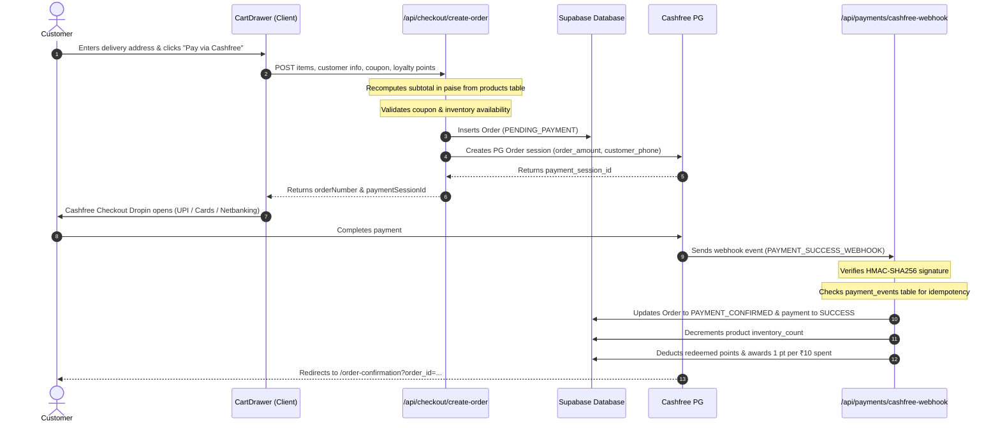

# The Petal & Bloom — Production Architecture & Operations Guide

## 1. Overview & Transformation Summary

"The Petal & Bloom" has been transformed from a prototype storefront into a production-grade, highly secure, full-stack artisanal commerce platform.

### Core Architectural Principles
- **Zero-Touch Safety on Live Production:** All database development, tables, storage, and RLS policies were created strictly on the isolated Supabase project (`bikivygxfjbdgpwieszs`). The original live database was never touched.
- **Frontend Aesthetic Preservation:** The bespoke "Atelier" design tokens (`linen`, `canvas`, `bark`, `rose`, `Fraunces`, `Karla`, smooth micro-interactions) are fully preserved.
- **Prepaid Cashfree Payments:** Financial calculations and order validation are strictly executed server-side in integer **paise** (`price_in_paise`, `total_in_paise`) to prevent client-side price tampering and floating-point errors.
- **Guest-First Checkout with Account Continuity:** Shoppers can check out seamlessly as guests without mandatory login. If they later register an account with their email or phone number, all past orders are automatically linked to their profile.
- **Closed-Loop Loyalty & Referral Economy:** Customers earn points on purchases, receive 50 welcome points upon registration, and can redeem points directly at checkout or earn 100 points per qualifying friend referral.

---

## 2. Infrastructure & Environment Configuration

### Required Environment Variables (`.env` & Vercel Dashboard)

| Variable | Scope | Description |
| :--- | :--- | :--- |
| `VITE_SUPABASE_URL` | Public (Client) | URL of your Supabase project (`https://bikivygxfjbdgpwieszs.supabase.co`) |
| `VITE_SUPABASE_ANON_KEY` | Public (Client) | Supabase Anonymous public API key (used for client queries protected by RLS) |
| `VITE_SITE_URL` | Public (Client) | Canonical public URL of the website (`https://thepetalandbloom.in` or Vercel URL) |
| `VITE_CASHFREE_MODE` | Public (Client) | `TEST` for sandbox testing; `PROD` for live payments |
| `SUPABASE_SERVICE_ROLE_KEY` | **Secret (Server Only)** | Elevated Supabase key for serverless endpoints (`/api/*`) |
| `CASHFREE_APP_ID` | **Secret (Server Only)** | Cashfree App ID (`TEST10565752b...` for sandbox, `CF...` for prod) |
| `CASHFREE_SECRET_KEY` | **Secret (Server Only)** | Cashfree Secret Key (`cfsk_ma_...`) |
| `CASHFREE_ENVIRONMENT` | **Secret (Server Only)** | `SANDBOX` for testing, `PRODUCTION` for live |
| `CASHFREE_WEBHOOK_SECRET` | **Secret (Server Only)** | Webhook secret for HMAC-SHA256 signature verification |

> [!IMPORTANT]
> Never expose `SUPABASE_SERVICE_ROLE_KEY` or `CASHFREE_SECRET_KEY` in frontend source code (`src/`). They are loaded strictly in `/api/*` serverless functions.

---

## 3. Cashfree Payment Lifecycle & Switching to Live

### Flow Diagram


### Switching from Test/Sandbox to Production Live Cashfree
1. Log in to the [Cashfree Merchant Dashboard](https://merchant.cashfree.com/merchants/login).
2. Switch to the **Production** environment toggle.
3. Generate **Production API Keys** (App ID and Secret Key).
4. In your production hosting environment (e.g. Vercel Project Settings > Environment Variables):
   - Set `CASHFREE_ENVIRONMENT=PRODUCTION`
   - Set `VITE_CASHFREE_MODE=PROD`
   - Set `CASHFREE_APP_ID=<your_prod_app_id>`
   - Set `CASHFREE_SECRET_KEY=<your_prod_secret_key>`
   - Set `CASHFREE_WEBHOOK_SECRET=<your_prod_webhook_secret>`
5. In Cashfree Merchant Dashboard > Developers > Webhooks, add your live webhook URL:
   `https://<your-domain>/api/payments/cashfree-webhook`
   Enable events: `ORDER.PAYMENT_SUCCESS`, `ORDER.PAYMENT_FAILED`.

---

## 4. Customer Portal & Loyalty Engine (`/account`)

### Capabilities
- **Authentication:** Supabase Auth via Email/Password or Magic Links.
- **Automatic Initialization:** When a user registers:
  1. A `profiles` record is created.
  2. A unique referral code (`PB-XXXXXX`) is generated.
  3. 50 Welcome Points are credited to `loyalty_accounts`.
  4. A welcome record is inserted into `loyalty_transactions`.
  5. Any prior guest orders placed with their email are automatically linked to their profile.
- **My Orders:** Live order history with real-time status badges, item breakdowns, total receipts, and tracking links.
- **Loyalty & Rewards:**
  - **Floret Tier (0–499 pts):** 1 pt per ₹10 spent, complimentary care card.
  - **Blossom Tier (500–1499 pts):** 1.25x points multiplier, priority crafting.
  - **Heirloom Tier (1500+ pts):** 1.5x points multiplier, free insured shipping, bespoke floral consultations.
  - Transparent activity ledger showing all earned and redeemed points.
- **Refer & Earn:** Shareable referral link and WhatsApp sharing button. When a referred friend places their first order, the referrer receives 100 points.
- **Saved Addresses:** Multi-address management for instant checkout prefill.

---

## 5. Admin Fulfillment Hub (`/admin/orders`)

### Order State Machine
```
PENDING_PAYMENT ──► PAYMENT_CONFIRMED ──► PROCESSING (Crafting) ──► PACKED ──► SHIPPED ──► DELIVERED
        │
        └──► PAYMENT_FAILED / CANCELLED
```

### Studio Logistics & Carrier Support
Supported carriers in `src/services/shippingService.ts`:
- **Delhivery:** Automatic public tracking URL generation (`https://www.delhivery.com/track/package/<AWB>`).
- **Shiprocket:** Aggregator tracking URL (`https://shiprocket.co//tracking/<AWB>`).
- **India Post:** Speed post tracking URL.
- **Manual:** Studio hand-delivery or local dispatch.

### Fulfillment Workflow
1. Studio admin logs in at `/admin/login`.
2. Navigates to **Orders & Shipments** (`/admin/orders`).
3. Selects an order to inspect items, custom gift notes, and destination address.
4. Clicks **"Copy Label"** to paste formatted address into courier software.
5. Advances status (e.g. `PAYMENT_CONFIRMED` -> `PROCESSING` -> `PACKED` -> `SHIPPED`).
6. Selects carrier, inputs AWB number, and adds internal/customer notes.
7. System updates order status, upserts `shipments`, and logs an immutable entry in `order_status_history`.

---

## 6. Security Hardening & Row Level Security (RLS)

- **RLS Across All 19 Tables:**
  - `orders`, `order_items`, `order_status_history`: Customers can only read orders where `customer_id = auth.uid()`. Admins have full access via `is_admin()`.
  - `customer_addresses`, `profiles`, `loyalty_accounts`, `loyalty_transactions`: Strict `auth.uid() = customer_id` isolation.
  - `products`, `categories`: Public read access for active records; mutation restricted to admins.
  - `audit_logs`, `payments`, `payment_events`: Restricted to service role and studio administrators.
- **Admin Access Control:**
  - `AdminRoute.tsx` strictly validates `profile.role in ('admin', 'super_admin')` against the database to prevent privilege escalation.

---

## 7. Verification & Health Check Commands

To verify the codebase at any time, run:

```bash
# Verify active database target is isolated
node scripts/verify-database-target.cjs

# Verify TypeScript type safety
npm run typecheck

# Verify production build compilation
npm run build
```
