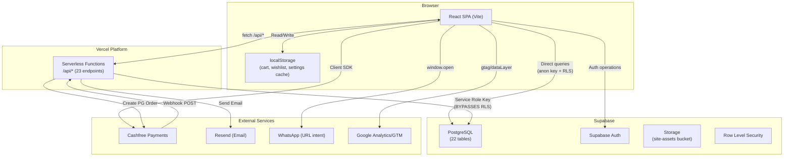
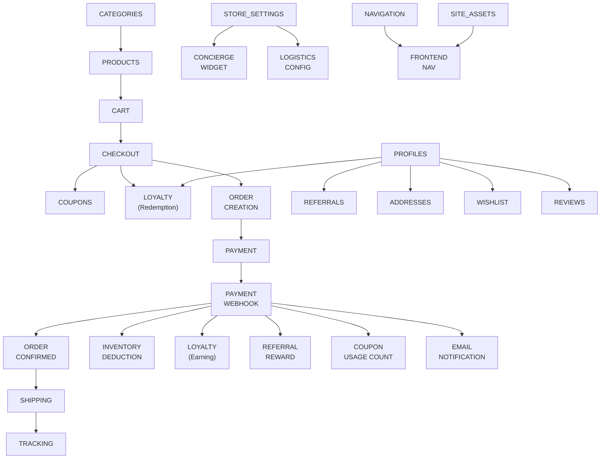

# THE PETAL & BLOOM — ARCHITECTURE DISCOVERY AUDIT

**Date:** 2026-09-29  
**Phase:** 0 — Read-Only System Extraction  
**Status:** COMPLETE — Awaiting Section-by-Section Discussion  
**Author:** Architecture Discovery Agent  

> [!CAUTION]
> NO CODE CHANGES WERE MADE. This document is the output of a read-only investigation.

---

## TABLE OF CONTENTS

1. [Executive Summary](#1-executive-summary)
2. [System Inventory](#2-system-inventory)
3. [Current Architecture Map](#3-current-architecture-map)
4. [Database Architecture](#4-database-architecture)
5. [Source of Truth Analysis](#5-source-of-truth-analysis)
6. [Authentication & Authorization Audit](#6-authentication--authorization-audit)
7. [API & Server Action Audit](#7-api--server-action-audit)
8. [Commerce Flow Trace](#8-commerce-flow-trace)
9. [Marketing Systems Audit](#9-marketing-systems-audit)
10. [Shipping Architecture](#10-shipping-architecture)
11. [Configuration & Feature Flags](#11-configuration--feature-flags)
12. [Frontend Architecture](#12-frontend-architecture)
13. [Security Audit](#13-security-audit)
14. [Patch Architecture Report](#14-patch-architecture-report)
15. [Failure Mode Analysis](#15-failure-mode-analysis)
16. [Business Rules Extraction](#16-business-rules-extraction)
17. [Feature Dependency Graph](#17-feature-dependency-graph)
18. [Performance & SEO Audit](#18-performance--seo-audit)
19. [Observability & Audit Logging](#19-observability--audit-logging)
20. [Architecture Review Scorecard](#20-architecture-review-scorecard)

---

## 1. EXECUTIVE SUMMARY

The Petal & Bloom is a luxury crochet/handmade floral bouquet ecommerce platform built as a **React SPA (Vite)** deployed on **Vercel** with **Supabase** (PostgreSQL + Auth + Storage) and **Cashfree Payments**.

### What Exists

| Layer | Technology | Status |
|-------|-----------|--------|
| Frontend | React 18 + Vite + Tailwind CSS | ✅ Functional |
| Backend API | Vercel Serverless Functions (`/api/*`) | ✅ 23 endpoints |
| Database | Supabase PostgreSQL | ✅ 22 tables |
| Auth | Supabase Auth | ✅ Customer + Admin |
| Payments | Cashfree PG | ✅ With webhook verification |
| Storage | Supabase Storage | ✅ Site assets |
| Shipping | Shiprocket / Delhivery / India Post | ⚠️ Partial (tracking URL only) |
| Loyalty | Petal Points (ledger model) | ⚠️ Partially server-validated |
| Coupons | Server-validated | ✅ Working |
| Referrals | Database tables exist | ⚠️ Reward logic incomplete |
| Reviews | Moderated review system | ✅ Working |
| Audit Logging | Fire-and-forget client → server | ⚠️ Unauthenticated endpoint |

### Critical Finding

> **The application has significant Broken Access Control vulnerabilities.** Most API endpoints execute with the Supabase Service Role Key but perform ZERO authentication or authorization checks on incoming requests. Any unauthenticated user can invoke admin-only operations like modifying store settings, deleting reviews, or linking orders to arbitrary accounts.

---

## 2. SYSTEM INVENTORY

| System | Exists? | Location | Purpose | Dependencies | Critical Problems |
|--------|---------|----------|---------|-------------|-------------------|
| **Customer Auth** | ✅ | `AuthContext.tsx`, `api/account/signup.ts` | Supabase email/password auth | Supabase Auth | No signup rate limiting |
| **Guest Checkout** | ✅ | `api/checkout/create-order.ts` | Orders without account | None | Guest orders stored with null customer_id |
| **Admin Auth** | ✅ | `AdminLogin.tsx`, `AdminRoute.tsx` | Role-checked login | `profiles.role` column | **Client-side only** — no server-side enforcement |
| **Products** | ✅ | `ProductContext.tsx`, DB `products` table | Product catalog | `categories` table | Entire catalog loaded into memory |
| **Categories** | ✅ | DB `categories` table | Product grouping | None | Clean |
| **Variants** | ❌ | N/A | Product variants | N/A | No variant system exists |
| **Inventory** | ⚠️ | `products.inventory_count` column | Stock tracking | Products | `is_made_to_order` flag bypasses count; no reservation system |
| **Cart** | ✅ | `CartContext.tsx` + localStorage | Shopping cart | Products | Client-side prices can go stale (mitigated at checkout) |
| **Checkout** | ✅ | `CartDrawer.tsx` → `create-order.ts` | Embedded checkout form | Cart, Coupons, Loyalty | No separate checkout page |
| **Coupons** | ✅ | `api/coupons/validate.ts`, `AdminCoupons.tsx` | Discount codes | Orders | `per_customer_limit` NOT enforced |
| **Influencer Coupons** | ⚠️ | `coupons` table (`is_influencer=true`) | Affiliate tracking | Coupons, Orders | Commission tracking incomplete; hardcoded 10% |
| **Loyalty** | ✅ | `loyalty_accounts` + `loyalty_transactions` | Petal Points system | Orders, Profiles | Tier upgrade logic server-side only in webhook |
| **Referrals** | ⚠️ | `referrals` table, `profiles.referral_code` | Customer referral program | Profiles, Loyalty | Reward logic incomplete in visible code |
| **Payments** | ✅ | `api/checkout/create-order.ts`, `cashfree-webhook.ts` | Cashfree PG integration | Orders | ✅ Properly idempotent webhook |
| **Orders** | ✅ | DB `orders` + `order_items` + `order_status_history` | Order management | Products, Payments, Shipping | No hard state machine constraints |
| **Shipping** | ⚠️ | `shippingService.ts`, `api/shipping/book-shipment.ts` | Carrier integration | Orders, Store Settings | Tracking URL only; no actual API integration visible |
| **Reviews** | ✅ | `api/reviews/*`, `AdminReviews.tsx` | Product reviews | Products, Orders | **Moderation endpoint unauthenticated** |
| **Wishlist** | ✅ | `WishlistContext.tsx`, DB `customer_wishlists` | Customer wishlist | Auth, Products | Cross-tab sync via BroadcastChannel |
| **Messages/Assistance** | ✅ | `AdminMessages.tsx`, `api/assistance/*` | Live customer support | Store Settings | 2-second polling interval |
| **Notifications (Email)** | ✅ | `api/lib/emailService.ts` | Order confirmation, dispatch | Resend API | Non-blocking fire-and-forget |
| **Notifications (WhatsApp)** | ✅ | `utils/whatsapp.ts`, URL intents | Customer communication | Store Settings | URL intent only — no API integration |
| **Analytics** | ✅ | `utils/analytics.ts` | Event tracking | Google Tag Manager | Client-side only |
| **SEO** | ⚠️ | `SEO.tsx` component | Meta tags, structured data | N/A | Client-side DOM injection — not SSR |
| **Audit Logging** | ⚠️ | `auditClient.ts` → `api/audit/log.ts` | Admin action trail | DB `audit_logs` | **Unauthenticated endpoint** |
| **Site Assets** | ✅ | `SiteAssetsContext.tsx`, `AdminAssets.tsx` | Dynamic CMS images | Supabase Storage | TTL cache (1hr) |
| **Navigation** | ✅ | `NavigationContext.tsx`, `AdminNavigation.tsx` | Dynamic nav menu | DB `navigation` | Cached in localStorage |
| **Store Settings** | ✅ | `StoreSettingsContext.tsx`, `api/settings/store.ts` | Business configuration | DB `store_settings` | **Unauthenticated API** |
| **RBAC** | ❌ | N/A | Role-based access control | N/A | Only `customer/admin/super_admin` in profiles.role |
| **Feature Flags** | ❌ | N/A | Feature toggles | N/A | No feature flag system exists |
| **Scheduled Jobs** | ❌ | N/A | Background processing | N/A | No cron or background job system |
| **Testing** | ⚠️ | Playwright in devDeps | E2E tests | N/A | No test files found in codebase |

---

## 3. CURRENT ARCHITECTURE MAP



### Critical Architectural Observation

The system has **two distinct data access patterns** that are in tension:

1. **Frontend → Supabase Direct** (via anon key, respects RLS): Used for reads (products, profiles, orders, wishlists, navigation, assets) and some writes (addresses, wishlists)
2. **Frontend → API → Supabase** (via service role key, bypasses RLS): Used for checkout, payment, settings, reviews, audit — but **without verifying the caller's identity**

> [!WARNING]
> Pattern #2 creates an architectural security gap. The API endpoints have full database access but no authentication middleware, making them equivalent to giving the service role key to the public internet.

---

## 4. DATABASE ARCHITECTURE

### 4.1 Schema Files

| File | Role | Tables Defined | Status |
|------|------|---------------|--------|
| `supabase/schema.sql` | **Authoritative master schema** | All 22 tables + RLS + triggers | Current |
| `supabase/COMPLETE_NEW_SETUP.sql` | Older combined setup + seed data | Partial, conflicts with schema.sql | Stale |
| `supabase/migrations/` | 8 sequential migration files | Incremental changes | Historical |

> [!IMPORTANT]
> `schema.sql` is the authoritative schema. `COMPLETE_NEW_SETUP.sql` contains an older, conflicting version of `store_settings`, `assistance_*` tables that lacks logistics fields and `product_reviews`.

### 4.2 Complete Table Inventory

| # | Table | Purpose | Rows Model | Key Relationships |
|---|-------|---------|-----------|-------------------|
| 1 | `profiles` | Customer & admin identities | Per auth.user | FK → auth.users (CASCADE) |
| 2 | `customer_addresses` | Delivery addresses | Per customer | FK → profiles (CASCADE) |
| 3 | `categories` | Product categories | Static catalog | None |
| 4 | `products` | Product catalog | Static catalog | FK → categories (SET NULL) |
| 5 | `orders` | Customer orders | Per transaction | FK → profiles (SET NULL) |
| 6 | `order_items` | Order line items (snapshots) | Per order line | FK → orders (CASCADE), FK → products (SET NULL) |
| 7 | `order_status_history` | Order state audit trail | Per transition | FK → orders (CASCADE) |
| 8 | `payments` | Cashfree payment records | Per order | FK → orders (CASCADE) |
| 9 | `payment_events` | Webhook idempotency log | Per webhook | Unique on `event_id` |
| 10 | `coupons` | Discount/influencer codes | Per code | None |
| 11 | `coupon_redemptions` | Coupon usage audit | Per use | FK → coupons (RESTRICT), FK → orders (CASCADE) |
| 12 | `loyalty_accounts` | Customer point balances | Per customer | FK → profiles (CASCADE) |
| 13 | `loyalty_transactions` | Points ledger entries | Per event | FK → profiles (CASCADE), FK → orders |
| 14 | `referrals` | Referral tracking | Per referral pair | FK → profiles (CASCADE for referrer, SET NULL for referee) |
| 15 | `shipments` | Shipping records | Per order | FK → orders (CASCADE) |
| 16 | `shipment_events` | Tracking history | Per update | FK → shipments (CASCADE) |
| 17 | `audit_logs` | Admin action audit trail | Per action | FK → auth.users |
| 18 | `store_settings` | Business configuration | Singleton (id='primary') | None |
| 19 | `product_reviews` | Customer reviews | Per review | FK → auth.users (SET NULL) |
| 20 | `assistance_conversations` | Support chat threads | Per conversation | FK → auth.users |
| 21 | `assistance_messages` | Chat messages | Per message | FK → conversations (CASCADE) |
| 22 | `customer_wishlists` | Wishlist items | Per item | FK → auth.users |
| 23 | `navigation` | Dynamic nav menu items | Per menu item | Self-referential parent_id |
| 24 | `site_assets` | CMS image references | Per asset key | None |

### 4.3 Database Functions

| Function | Type | Purpose |
|----------|------|---------|
| `handle_updated_at()` | Trigger function | Sets `updated_at = now()` on update |
| `is_admin()` | SECURITY DEFINER | Returns boolean if `auth.uid()` has admin/super_admin role |
| `is_super_admin()` | SECURITY DEFINER | Returns boolean if `auth.uid()` has super_admin role |

### 4.4 Triggers

All trigger the `handle_updated_at()` function BEFORE UPDATE:
- `profiles`, `customer_addresses`, `products`, `orders`, `payments`, `coupons`, `shipments`

### 4.5 RLS Policies Summary

| Table | Public Read | Own Data | Admin Full | Notes |
|-------|-----------|----------|-----------|-------|
| `profiles` | ❌ | ✅ (own row) | ✅ | Users can update own profile |
| `products` | ✅ (active only) | N/A | ✅ | Public catalog access |
| `categories` | ✅ (active only) | N/A | ✅ | Public catalog access |
| `orders` | ❌ | ✅ (own orders) | ✅ | Customers see own orders |
| `loyalty_accounts` | ❌ | ✅ (own) | ✅ | |
| `loyalty_transactions` | ❌ | ✅ (own) | ✅ | |
| `audit_logs` | ❌ | ❌ | ✅ (select only) | Insert via service role; no update/delete |
| `product_reviews` | ✅ (approved) | ✅ (own) | ✅ | |
| `customer_wishlists` | ❌ | ✅ (own) | ✅ | |

### 4.6 Database Issues Identified

| Issue | Severity | Details |
|-------|----------|---------|
| **Missing FK**: `profiles.referred_by` | Medium | Text column, should FK to `profiles.referral_code` |
| **Denormalized**: `products.category_slug` | Low | Duplicates `categories.slug` via `category_id` FK |
| **Missing FK**: `product_reviews.product_code` | Medium | No FK to `products.code` — could reference deleted products |
| **Inconsistent FK targets**: `reviews`, `wishlists`, `assistance` | Medium | Reference `auth.users(id)` instead of `profiles(id)` |
| **No product variants table** | Low | By design (no variants currently needed) |
| **No inventory reservation** | High | `inventory_count` is directly decremented, no concurrent checkout protection |
| **No abandoned order cleanup** | Medium | `PENDING_PAYMENT` orders accumulate indefinitely |

### 4.7 Entity Relationship Map

```text
auth.users
    │
    └── profiles (1:1)
            │
            ├── customer_addresses (1:N)
            ├── orders (1:N, nullable customer_id for guests)
            │       ├── order_items (1:N)
            │       ├── order_status_history (1:N)
            │       ├── payments (1:N)
            │       ├── shipments (1:N)
            │       │       └── shipment_events (1:N)
            │       ├── coupon_redemptions (N:1 → coupons)
            │       └── loyalty_transactions (via order_id)
            │
            ├── loyalty_accounts (1:1)
            ├── loyalty_transactions (1:N)
            ├── referrals (as referrer, 1:N)
            ├── product_reviews (1:N)
            ├── customer_wishlists (1:N)
            └── assistance_conversations (1:N)
                    └── assistance_messages (1:N)

categories (independent)
    └── products (1:N via category_id)

coupons (independent)
    └── coupon_redemptions (1:N)

store_settings (singleton)
navigation (self-referential hierarchy)
site_assets (key-value)
audit_logs (append-only)
payment_events (webhook idempotency log)
```

---

## 5. SOURCE OF TRUTH ANALYSIS

| Domain | Current Source of Truth | Secondary Copies | Risk Level |
|--------|----------------------|-----------------|------------|
| **Product Price** | `products.price_in_paise` (DB) | `CartItem.price` (localStorage) | 🟡 Low — Server recalculates at checkout |
| **Product Inventory** | `products.inventory_count` (DB) | None | 🔴 High — No reservation; concurrent checkout race |
| **Customer Identity** | `auth.users` + `profiles` (DB) | `AuthContext` state (memory) | 🟢 Safe — Context syncs with Supabase |
| **Order Status** | `orders.order_status` (DB) | `order_status_history` (DB, append-only) | 🟡 Medium — Two representations, history is audit only |
| **Payment Status** | `payments.status` (DB) + `orders.payment_status` (DB) | `payment_events` (webhook log) | 🔴 High — Two status fields on different tables |
| **Shipping Status** | `shipments.status` (DB) | `shipment_events` (DB, append-only) | 🟡 Medium — Manual updates only |
| **Loyalty Balance** | `loyalty_accounts.points_balance` (DB) | Derived from `loyalty_transactions` sum | 🟡 Medium — Mutable balance + ledger exists |
| **Coupon Usage** | `coupons.usage_count` (DB) | Derived from `coupon_redemptions` count | 🟡 Medium — Counter + audit trail |
| **Discount Amount** | Server calculation in `create-order.ts` | Client display in `CartDrawer.tsx` | 🟢 Safe — Server is authoritative |
| **Final Order Total** | `orders.total_in_paise` (DB, set by server) | Client display | 🟢 Safe — Server calculates |
| **Store Settings** | `store_settings` table (DB) | `localStorage` cache, `StoreSettingsContext` | 🟡 Medium — Stale cache up to 1hr |

---

## 6. AUTHENTICATION & AUTHORIZATION AUDIT

### 6.1 Customer Authentication

**FACT:** Customers authenticate via Supabase Auth (email/password). Registration goes through `/api/account/signup` which uses `supabaseAdmin.auth.admin.createUser()` to bypass client-side rate limits.

**RISK:** No CAPTCHA, no backend rate limiting on the signup endpoint. Vulnerable to mass account creation.

### 6.2 Admin Authentication

**FACT:** Admin login (`AdminLogin.tsx`) uses standard Supabase `signInWithPassword`. After login, a DB query checks `profiles.role === 'admin' || 'super_admin'`. If the role doesn't match, the session is signed out.

**FACT:** `AdminRoute.tsx` is a client-side route guard that renders `<Outlet />` only if the profile role is admin/super_admin.

### 6.3 Authorization Model

```text
CURRENT STATE:

profiles.role = 'customer' | 'admin' | 'super_admin'

Frontend: AdminRoute checks role → shows/hides admin UI
Backend:  NOTHING checks role → all API endpoints are open

RLS:      is_admin() / is_super_admin() functions used in DB policies
          BUT: API endpoints use service role key, which BYPASSES RLS
```

> [!CAUTION]
> **There is NO server-side authorization on ANY API endpoint.** The API layer acts as a completely open gateway to the service role key. This means any unauthenticated HTTP request to `/api/settings/store` (POST), `/api/reviews/moderate` (POST), `/api/account/link-orders` (POST), or `/api/audit/log` (POST) will execute with full database privileges.

### 6.4 RBAC Assessment

**Current state:** Three hardcoded roles with no permission granularity.

**What's missing:**
- No permission model (resources × actions)
- No server-side role verification on API calls
- No role hierarchy
- No staff user management UI
- `super_admin` and `admin` have identical capabilities everywhere

---

## 7. API & SERVER ACTION AUDIT

### Complete API Endpoint Inventory

| Endpoint | Method | Purpose | Auth Check | Authorization | DB Effect | Idempotent? |
|----------|--------|---------|-----------|---------------|-----------|------------|
| `/api/account/signup` | POST | Customer registration | ❌ None | ❌ None | Creates auth.user + profile + loyalty_account | ❌ No |
| `/api/account/link-orders` | POST | Link guest orders to account | ❌ None | ❌ None | Updates orders.customer_id | ❌ No — **CRITICAL** |
| `/api/checkout/create-order` | POST | Create order + payment session | ❌ None | ❌ None | Creates order, items, payment, status_history | ❌ No |
| `/api/coupons/validate` | POST | Validate coupon code | ❌ None | ❌ None | Read-only | ✅ Yes |
| `/api/payments/cashfree-webhook` | POST | Payment confirmation | ✅ HMAC-SHA256 | N/A (machine-to-machine) | Updates order, payment, loyalty, inventory | ✅ Yes (event_id dedup) |
| `/api/payments/refund` | POST | Process refund | ❌ None | ❌ None | Calls Cashfree refund API | ❌ No — **CRITICAL** |
| `/api/orders/cancel` | POST | Cancel order | ❌ None | ❌ None | Updates order status | ❌ No |
| `/api/orders/notify` | POST | Send email/notification | ❌ None | ❌ None | Sends email via Resend | ❌ No |
| `/api/orders/track` | GET | Track order by number | ❌ None | ❌ None | Read-only | ✅ Yes |
| `/api/reviews/submit` | POST | Submit product review | ❌ None | ❌ None | Inserts review | ❌ No |
| `/api/reviews/moderate` | POST | Approve/delete review | ❌ None | ❌ None | Updates/deletes review | ❌ No — **CRITICAL** |
| `/api/reviews/list` | GET | List reviews for product | ❌ None | ❌ None | Read-only | ✅ Yes |
| `/api/settings/store` | GET/POST | Read/write store settings | ❌ None | ❌ None | Reads/writes store_settings | ❌ No — **CRITICAL** |
| `/api/audit/log` | POST | Write audit log entry | ❌ None | ❌ None | Inserts audit_log | ❌ No |
| `/api/audit/list` | GET | List audit log entries | ❌ None | ❌ None | Read-only | ✅ Yes |
| `/api/assistance/conversations` | GET | List conversations | ❌ None | ❌ None | Read-only | ✅ Yes |
| `/api/assistance/messages` | GET/POST | Read/write messages | ❌ None | ❌ None | Reads/writes messages | ❌ No |
| `/api/shipping/book-shipment` | POST | Book carrier shipment | ❌ None | ❌ None | Creates shipment, calls carrier API | ❌ No |
| `/api/sitemap` | GET | Generate XML sitemap | ❌ None | N/A | Read-only | ✅ Yes |

> **21 out of 23 endpoints have ZERO authentication. 6 of those are critically exploitable.**

---

## 8. COMMERCE FLOW TRACE

### End-to-End Checkout Flow

```text
Customer browses → ProductDetail.tsx
    ↓
Adds to cart → CartContext.tsx → localStorage ('tpb-cart')
    ↓
Opens cart drawer → CartDrawer.tsx
    ↓
Enters coupon → CartContext.applyCoupon() → /api/coupons/validate
    ↓
Toggles loyalty points → Client-side calculation (1pt = ₹0.50)
    ↓
Clicks checkout → CartDrawer shows embedded checkout form
    ↓
Enters: name, phone, email, address
    ↓
Submits → POST /api/checkout/create-order
    ↓ SERVER-SIDE:
    ├── Validates phone (10 digits), pincode (6 digits)
    ├── Fetches product prices from DB (does NOT trust client prices) ✅
    ├── Validates coupon (active, not expired, usage_limit, min_order) ✅
    ├── Validates loyalty points balance ✅
    ├── Calculates: subtotal + gift wrap (₹79/ea) - discount - loyalty + shipping
    ├── Shipping: Free ≥₹1200; ₹49 ≥₹799; ₹69 otherwise
    ├── Creates ORDER (status: PENDING_PAYMENT)
    ├── Creates ORDER_ITEMS (price snapshots)
    ├── Creates ORDER_STATUS_HISTORY entry
    ├── Deducts loyalty points (REDEEM_PURCHASE transaction)
    ├── Auto-saves address for logged-in users
    ├── Creates PAYMENT record (status: PENDING)
    └── Calls Cashfree createCashfreePGOrder() → returns paymentSessionId
    ↓
Client launches Cashfree embedded checkout (src/lib/cashfree.ts)
    ↓
Customer pays → Cashfree processes
    ↓ TWO PATHS:
    ├── Path A: Client redirect → /order-confirmation?order_id=xxx
    │           (Display only — not authoritative)
    │
    └── Path B: Cashfree webhook → POST /api/payments/cashfree-webhook
                ↓ SERVER-SIDE:
                ├── Verifies HMAC-SHA256 signature ✅
                ├── Checks payment_events for duplicate event_id ✅
                ├── Verifies payment via Cashfree API call ✅
                ├── Updates payments.status = SUCCESS
                ├── Updates orders.order_status = PAYMENT_CONFIRMED
                ├── Updates orders.payment_status = SUCCESS
                ├── Decrements products.inventory_count ⚠️ (no reservation)
                ├── Awards loyalty points (1pt per ₹20 spent)
                ├── Auto-upgrades loyalty tier
                ├── Processes referrer reward (if applicable)
                ├── Increments coupons.usage_count
                ├── Creates coupon_redemptions record
                └── Sends order confirmation email (fire-and-forget)
```

### Order Status Machine (Current)

```text
PENDING_PAYMENT → PAYMENT_CONFIRMED → ORDER_CONFIRMED → PROCESSING → PACKED → SHIPPED → OUT_FOR_DELIVERY → DELIVERED
                → PAYMENT_FAILED
                                                                                                            → CANCELLED
```

**FACT:** There are no hard constraints enforcing valid transitions. Any admin can set any status via direct Supabase update from `AdminOrders.tsx`.

**FACT:** `order_status_history` provides an audit trail but does not enforce transition rules.

---

## 9. MARKETING SYSTEMS AUDIT

### 9.1 Loyalty System (Petal Points)

| Aspect | Implementation | Location |
|--------|---------------|----------|
| Earning | 1 pt per ₹20 spent | `cashfree-webhook.ts` (server) |
| Welcome Bonus | 40 pts on registration | `api/account/signup.ts` (server) |
| Redemption | 2 pts = ₹1 (1pt = ₹0.50) | `CartDrawer.tsx` (client) + `create-order.ts` (server validates) |
| Min redemption order | ₹299 | `CartDrawer.tsx` (client) + `create-order.ts` (server) |
| Balance constraint | `CHECK (points_balance >= 0)` | Database |
| Tiers | FLORET → BLOSSOM → HEIRLOOM | Webhook auto-upgrades based on lifetime_points |
| Admin adjustment | ADJUSTMENT type exists | **No UI for manual adjustment** |
| Refund/cancellation handling | **NOT IMPLEMENTED** | Points already awarded are not reversed |

**Architecture:** Hybrid ledger. `loyalty_accounts.points_balance` is the mutable authoritative balance, but `loyalty_transactions` provides an auditable history. This is acceptable but creates a dual-source risk if they diverge.

### 9.2 Coupon System

| Aspect | Implementation | Location |
|--------|---------------|----------|
| Types | PERCENT, FLAT | `coupons.discount_type` |
| Validation | Server-side | `api/coupons/validate.ts` |
| Application | Server recalculates | `api/checkout/create-order.ts` |
| Usage tracking | `usage_count` + `coupon_redemptions` | DB |
| **Per-customer limit** | Column exists | **NOT ENFORCED** in validate endpoint |
| Stacking | One coupon at a time | Can stack with loyalty points |

### 9.3 Influencer System

**FACT:** Influencers are modeled as special coupons (`is_influencer = true`).

**RISK:** `AdminInfluencers.tsx` fetches ALL orders to calculate GMV in-memory. Will crash at scale.

**RISK:** Commission tracking is broken — `commission_paid_inr` is hardcoded to 0, UI hardcodes 10% instead of reading `commission_percent`.

### 9.4 Referral System

**FACT:** `profiles.referral_code` and `referrals` table exist. Welcome bonus (40pts) is given on signup.

**RISK:** The referrer reward (100pts on qualifying order) logic is present in `cashfree-webhook.ts` but the transition from PENDING → REWARDED status is unclear.

### 9.5 Abandoned Carts

**FACT:** Not a separate system. `AdminAbandonedCarts.tsx` simply queries `orders WHERE order_status = 'PENDING_PAYMENT'`.

**RISK:** No automated recovery. No order expiry/cleanup. Stale orders accumulate indefinitely.

---

## 10. SHIPPING ARCHITECTURE

### Current State

```text
ShippingService (src/services/shippingService.ts)
    │
    ├── generateTrackingUrl(carrier, awb) → URL string
    ├── calculateEstimatedDelivery(date, prepDays)
    ├── validateIndianPincode(pincode)
    └── SUPPORTED_CARRIERS constant

AdminOrders.tsx
    │
    └── Manual AWB entry → inserts into shipments table → optional /api/orders/notify

api/shipping/book-shipment.ts
    │
    └── Shiprocket/Delhivery API integration (279 lines)
```

**INFERENCE:** The shipping "abstraction" is currently a thin utility layer. `book-shipment.ts` contains actual carrier API calls but the admin UI (`AdminOrders.tsx`) appears to do manual AWB entry as the primary workflow.

**FACT:** No webhook handling exists for carrier tracking updates. `shipment_events` table exists but is only populated manually.

---

## 11. CONFIGURATION & FEATURE FLAGS

### Current Configuration Architecture

```text
store_settings (DB table, singleton row id='primary')
    │
    ├── Contact Info: whatsapp, email, instagram
    ├── Legal: business name, GSTIN, studio address
    ├── Logistics: shiprocket/delhivery API keys, pickup details
    └── Modes: conciergeChannelMode, logisticsAutomationMode

Environment Variables (.env)
    │
    ├── Client: VITE_SUPABASE_URL, VITE_SUPABASE_ANON_KEY, VITE_SITE_URL, VITE_CASHFREE_MODE
    └── Server: SUPABASE_SERVICE_ROLE_KEY, CASHFREE_*, RESEND_API_KEY, EMAIL_FROM

Hardcoded Constants
    │
    ├── Shipping thresholds: Free ≥₹1200, ₹49 ≥₹799, ₹69 else
    ├── Gift wrap price: ₹79
    ├── Loyalty rates: 1pt/₹20, 2pt=₹1
    ├── Min redemption: ₹299
    └── Welcome bonus: 40 pts
```

### Feature Flag Assessment

**FACT:** No feature flag system exists.

| Feature | Can be disabled? | How? | Risk if disabled |
|---------|-----------------|------|-----------------|
| Loyalty | ❌ No toggle | Would need code changes | Checkout would break (loyalty_discount_in_paise column) |
| Referrals | ❌ No toggle | Remove UI code | Profiles still generate referral_code |
| Coupons | ⚠️ Partial | Deactivate all coupons in DB | Coupon input still shows in UI |
| Influencers | ⚠️ Partial | Delete influencer coupons | Admin page still renders |
| Reviews | ❌ No toggle | Would need code changes | |
| Wishlist | ❌ No toggle | Would need code changes | |
| Guest checkout | ❌ No toggle | Would need code changes | |
| In-system chat | ✅ Toggle exists | `conciergeChannelMode` setting | Falls back to WhatsApp |

---

## 12. FRONTEND ARCHITECTURE

### 12.1 Technology Stack

| Component | Technology | Version |
|-----------|-----------|---------|
| Framework | React | 18.3.1 |
| Build tool | Vite | 5.4.8 |
| Routing | react-router-dom | 6.30.6 |
| Styling | Tailwind CSS | Custom Atelier theme |
| Icons | lucide-react | 0.446.0 |
| Backend client | @supabase/supabase-js | 2.116.0 |
| State | React Context (9 providers) | N/A |
| Testing | Playwright (devDep) | No tests found |

### 12.2 Route Map

**Public Routes (16):**
`/`, `/shop`, `/product/:code`, `/wishlist`, `/custom`, `/custom-bouquet`, `/gift-finder`, `/about`, `/contact`, `/account`, `/order-confirmation`, `/track`, `/privacy`, `/terms`, `/refund`, `*` (404)

**Admin Routes (14):**
`/admin/login`, `/admin/dashboard`, `/admin/orders`, `/admin/customers`, `/admin/messages`, `/admin/reviews`, `/admin/navigation`, `/admin/editor`, `/admin/assets`, `/admin/settings`, `/admin/coupons`, `/admin/influencers`, `/admin/abandoned-carts`, `/admin/audit-logs`, `/admin/reports`

### 12.3 State Management

9 React Context providers nested in this order:
1. `NotificationProvider` — Toast notifications
2. `AuthProvider` — User, session, profile, loyalty, isAdmin
3. `StoreSettingsProvider` — Business config + concierge
4. `WishlistProvider` — Wishlist sync (BroadcastChannel)
5. `ProductProvider` — Full product catalog
6. `CartProvider` — Cart items, coupon, checkout
7. `QuickViewProvider` — Product quick-view modal
8. `SiteAssetsProvider` — Dynamic CMS images (TTL cache)
9. `NavigationProvider` — Dynamic nav menu (TTL cache)

**RISK:** `ProductProvider` loads the ENTIRE product catalog into memory on mount. No pagination, no lazy loading. Will degrade as catalog grows.

### 12.4 Design System

Custom Tailwind theme with distinct Atelier aesthetic:
- **Fonts:** Fraunces (serif headings), Karla (body)
- **Colors:** linen, canvas, bark, rose, moss, ink
- **Border radius:** Custom asymmetric patterns (`.rounded-atelier-btn`, `.rounded-atelier-img`, `.rounded-atelier-panel`)
- **Animations:** fade-in, fade-up, gentle-zoom, slide-in

### 12.5 Bundle Analysis

```text
dist/index.html                   2.32 kB
dist/assets/index-CaaZboXN.css   71.09 kB (gzip: 12.17 kB)
dist/assets/vendor-D8R1wcW5.js  426.93 kB (gzip: 119.22 kB)
dist/assets/index-Cx1hbbPZ.js   564.62 kB (gzip: 124.40 kB)  ⚠️ >500kB
```

**RISK:** No route-level code splitting. No `React.lazy()` or `Suspense`. All pages are eagerly imported. The main bundle exceeds 500kB.

---

## 13. SECURITY AUDIT

### 13.1 Critical Vulnerabilities

| # | Vulnerability | Severity | Location | Impact |
|---|-------------|----------|----------|--------|
| S1 | **Broken Access Control: Store Settings** | 🔴 CRITICAL | `/api/settings/store` | Anyone can modify business settings, logistics API keys |
| S2 | **Broken Access Control: Review Moderation** | 🔴 CRITICAL | `/api/reviews/moderate` | Anyone can approve/delete reviews |
| S3 | **Broken Access Control: Order Linking** | 🔴 CRITICAL | `/api/account/link-orders` | Anyone can claim guest orders by supplying arbitrary email/phone |
| S4 | **Broken Access Control: Refund** | 🔴 CRITICAL | `/api/payments/refund` | Anyone can trigger payment refunds |
| S5 | **Broken Access Control: Order Cancellation** | 🔴 HIGH | `/api/orders/cancel` | Anyone can cancel orders |
| S6 | **Broken Access Control: Shipment Booking** | 🔴 HIGH | `/api/shipping/book-shipment` | Anyone can trigger carrier API calls |
| S7 | **No signup rate limiting** | 🟡 MEDIUM | `/api/account/signup` | Mass account creation |
| S8 | **Coupon per_customer_limit not enforced** | 🟡 MEDIUM | `/api/coupons/validate` | Single-use coupons can be reused |
| S9 | **Audit log endpoint unauthenticated** | 🟡 MEDIUM | `/api/audit/log` | Anyone can inject fake audit entries |
| S10 | **Client-side SPA SEO** | 🟡 LOW | `SEO.tsx` | Search engines may not index properly |

### 13.2 Positive Security Findings

| # | Finding | Status |
|---|---------|--------|
| ✅ | Cashfree webhook HMAC-SHA256 verification | Properly implemented with timing-safe comparison |
| ✅ | Payment amount calculated server-side | Client prices NOT trusted |
| ✅ | Webhook idempotency via event_id dedup | Duplicate webhooks safely ignored |
| ✅ | Service role key NOT exposed to client | Only `VITE_*` vars in browser |
| ✅ | `.env` in `.gitignore` | Secrets not in source control |
| ✅ | RLS enabled on sensitive tables | Policies correctly scoped |
| ✅ | Money stored as paise (integers) | No floating-point currency issues |

---

## 14. PATCH ARCHITECTURE REPORT

### P1: Admin Authorization is Purely Cosmetic

**Problem:** Authorization only exists in the browser (`AdminRoute.tsx`). The API layer has zero checks.

**Where:** All 23 `/api/*` endpoints.

**Why patch architecture:** The admin UI was built incrementally. Each new feature added frontend protection but never established a shared server-side auth middleware.

**Risk:** 🔴 Critical. Complete privilege escalation.

**Proposed boundary:** Centralized auth middleware that validates JWT and checks role before any admin API executes.

---

### P2: Direct Database Access from Admin UI Components

**Problem:** Admin pages (`AdminOrders`, `AdminCustomers`, `AdminCoupons`, etc.) perform direct Supabase queries using the client-side anon key + RLS. This means business logic lives inside React components.

**Where:** All `src/pages/admin/*.tsx` files.

**Why patch architecture:** Each admin page was built independently, each implementing its own data fetching and mutation logic inline.

**Risk:** 🟡 Medium. Business rules are scattered across UI components. No centralized enforcement. RLS provides some protection but rules are duplicated.

**Proposed boundary:** Admin operations should go through authenticated API endpoints with centralized business logic.

---

### P3: Dual Configuration System

**Problem:** Settings live in BOTH `store_settings` (DB) AND environment variables. Shipping credentials appear in both locations. The `StoreSettingsContext` falls back to hardcoded defaults when the API fails.

**Where:** `StoreSettingsContext.tsx` (defaults), `api/settings/store.ts`, `.env`

**Why patch architecture:** Settings were initially in code, then partially moved to DB, but the fallback chain was never cleaned up.

**Risk:** 🟡 Medium. Confusion about which value is authoritative. Credentials stored in DB are accessible to anyone who can read `store_settings`.

---

### P4: Multiple Notification Mechanisms

**Problem:** Three separate notification approaches: Email (Resend API), WhatsApp (URL intents), In-System Chat (polling-based). No unified notification service.

**Where:** `emailService.ts`, `utils/whatsapp.ts`, `AtelierConciergeWidget.tsx`, `AdminMessages.tsx`

**Why patch architecture:** Each channel was added as a separate feature without a unifying abstraction.

---

### P5: Loyalty Points Not Reversed on Cancellation/Refund

**Problem:** When an order is cancelled or refunded, the loyalty points earned from that order are NOT reversed. This means customers can earn points, cancel, and keep the points.

**Where:** `api/orders/cancel.ts` does not touch `loyalty_transactions`. No reversal logic found anywhere.

**Risk:** 🔴 High. Financial/loyalty leak.

---

### P6: Inventory Has No Reservation System

**Problem:** Inventory is only decremented on payment confirmation (webhook). Between order creation and payment, no inventory is reserved. Two simultaneous customers could purchase the last item.

**Where:** `api/payments/cashfree-webhook.ts` (decrement), `api/checkout/create-order.ts` (no reservation)

**Risk:** 🟡 Medium for a made-to-order business. Higher risk if stock items are introduced.

---

### P7: Audit Logging is Untrustworthy

**Problem:** Audit events are submitted from the client via unauthenticated POST to `/api/audit/log`. Anyone can fabricate audit entries. The actor identity is self-reported in the payload.

**Where:** `auditClient.ts` (client), `api/audit/log.ts` (server)

**Risk:** 🟡 Medium. Audit trail cannot be trusted for compliance or forensics.

---

## 15. FAILURE MODE ANALYSIS

### Checkout Failures

| Step | Failure | Current Handling | Risk |
|------|---------|-----------------|------|
| DB fails during order creation | Server returns 500 | ✅ No payment created | 🟢 Safe |
| Cashfree session creation fails | Server returns 500 | ✅ Order exists as PENDING_PAYMENT | 🟢 Safe |
| Payment succeeds, callback fails | Webhook still fires | ✅ Webhook is authoritative | 🟢 Safe |
| Webhook fires twice | `event_id` dedup | ✅ Second ignored | 🟢 Safe |
| Webhook fires late | Order stays PENDING_PAYMENT | ⚠️ Eventually consistent | 🟡 Low |
| Customer closes browser mid-payment | Webhook updates regardless | ✅ Safe | 🟢 Safe |
| Payment succeeds, order creation already done | N/A (order created before payment) | ✅ Safe | 🟢 Safe |

### Loyalty Failures

| Step | Failure | Current Handling | Risk |
|------|---------|-----------------|------|
| Points redeemed, order cancelled | **Points NOT restored** | ❌ Leaked | 🔴 High |
| Points earned, order refunded | **Points NOT reversed** | ❌ Leaked | 🔴 High |

### Coupon Failures

| Step | Failure | Current Handling | Risk |
|------|---------|-----------------|------|
| Two simultaneous users apply last-use coupon | `usage_count` check has race condition | ⚠️ Possible double-use | 🟡 Medium |
| Coupon used beyond per_customer_limit | **Not checked** | ❌ Exploitable | 🟡 Medium |

---

## 16. BUSINESS RULES EXTRACTION

### BR1: Shipping Calculation
- **Rule:** Free shipping ≥ ₹1,200; ₹49 shipping ≥ ₹799; ₹69 otherwise
- **Location:** `api/checkout/create-order.ts` (lines ~280-290)
- **Hardcoded:** Yes. Not configurable from admin.

### BR2: Gift Wrap Pricing
- **Rule:** ₹79 per item with gift wrap
- **Location:** `api/checkout/create-order.ts`
- **Hardcoded:** Yes.

### BR3: Loyalty Earning
- **Rule:** 1 Petal Point per ₹20 spent
- **Location:** `api/payments/cashfree-webhook.ts`
- **Hardcoded:** Yes.

### BR4: Loyalty Redemption
- **Rule:** 2 Petal Points = ₹1.00 (1pt = ₹0.50)
- **Location:** `CartDrawer.tsx` (client) + `create-order.ts` (server)
- **Hardcoded:** Yes.

### BR5: Minimum Redemption Order
- **Rule:** Can only redeem points on orders ≥ ₹299
- **Location:** `CartDrawer.tsx` (client) + `create-order.ts` (server)
- **Hardcoded:** Yes.

### BR6: Welcome Bonus
- **Rule:** 40 Petal Points on account creation
- **Location:** `api/account/signup.ts`
- **Hardcoded:** Yes.

### BR7: Referrer Reward
- **Rule:** 100 points to referrer on referee's first qualifying order
- **Location:** `api/payments/cashfree-webhook.ts`
- **Hardcoded:** Yes.

### BR8: Coupon Validation
- **Rule:** Check active, not expired, usage_limit > usage_count, min_order_in_paise
- **Location:** `api/coupons/validate.ts`
- **Missing:** `per_customer_limit` check

### BR9: Order Number Generation
- **Rule:** `TPB-{timestamp}-{random4chars}`
- **Location:** `api/checkout/create-order.ts`

---

## 17. FEATURE DEPENDENCY GRAPH



### Key Dependencies

| Feature | Depends On | Depended On By | Can be safely disabled? |
|---------|-----------|----------------|----------------------|
| Products | Categories | Cart, Checkout, Reviews, Wishlist | ❌ Core |
| Cart | Products, localStorage | Checkout | ❌ Core |
| Checkout | Cart, Products, Coupons, Loyalty | Orders | ❌ Core |
| Orders | Checkout, Payments | Shipping, Loyalty, Referrals | ❌ Core |
| Payments | Cashfree, Orders | Order confirmation | ❌ Core |
| Loyalty | Profiles, Orders | Checkout (optional) | ⚠️ Would need code changes |
| Coupons | None (standalone) | Checkout (optional) | ⚠️ Would need code changes |
| Referrals | Profiles, Loyalty | None | ⚠️ Partially independent |
| Shipping | Orders, Carriers | Tracking | ✅ Manual fallback exists |
| Reviews | Products, Orders | None | ✅ Can be disabled |
| Wishlist | Products, Auth | None | ✅ Can be disabled |

---

## 18. PERFORMANCE & SEO AUDIT

### Performance

| Issue | Severity | Details |
|-------|----------|---------|
| No code splitting | 🟡 Medium | All 30+ pages eagerly imported. Main bundle > 500kB |
| Full catalog in memory | 🟡 Medium | `ProductProvider` loads all products on mount |
| No image optimization | 🟡 Medium | Standard `` tags; no next/image or CDN transforms |
| 2-second polling in messages | 🟡 Medium | `AdminMessages.tsx` polls every 2 seconds |
| AdminInfluencers loads all orders | 🔴 High | Fetches entire orders table for in-memory GMV calculation |

### SEO

| Aspect | Current State | Issue |
|--------|-------------|-------|
| Meta tags | Client-side DOM injection via `SEO.tsx` | Not SSR — crawlers may miss |
| Structured data | JSON-LD for Store, Product | Client-side injection |
| Sitemap | `/api/sitemap` generates XML | ✅ Functional |
| Canonical URLs | Set via `SEO.tsx` | Client-side |
| Open Graph | Present in `SEO.tsx` | Client-side |

---

## 19. OBSERVABILITY & AUDIT LOGGING

### Current State

| Aspect | Exists? | Implementation | Trustworthy? |
|--------|---------|---------------|-------------|
| Audit trail | ✅ | `audit_logs` table | ❌ Unauthenticated source |
| Order history | ✅ | `order_status_history` | ✅ Server-populated |
| Payment events | ✅ | `payment_events` table | ✅ Webhook-populated |
| Shipment events | ✅ | `shipment_events` table | ⚠️ Manually populated |
| Error tracking | ❌ | `console.error` only | N/A |
| Request tracing | ❌ | None | N/A |
| Structured logging | ❌ | `console.log/warn/error` | N/A |
| Analytics | ✅ | Google Analytics via gtag | Client-side only |

---

## 20. ARCHITECTURE REVIEW SCORECARD

### Architecture Clarity
- **Current state:** Moderate. Clear separation between storefront and admin pages. Unclear separation between client-side and server-side responsibilities.
- **Evidence:** Admin pages perform direct DB mutations. API endpoints lack consistent patterns. Business logic scattered across `CartDrawer.tsx`, `create-order.ts`, `cashfree-webhook.ts`, and individual admin pages.
- **Risk:** High maintenance burden as features grow.

### Data Integrity
- **Current state:** Good for payments (idempotent webhooks, server-side calculation). Weak for loyalty (no reversal on cancel/refund).
- **Evidence:** Cashfree webhook properly uses `event_id` deduplication. Loyalty `points_balance` can diverge from `loyalty_transactions` sum.
- **Risk:** Financial leakage through loyalty point manipulation.

### Security
- **Current state:** 🔴 Critical gaps. Payment path is secure. Everything else is open.
- **Evidence:** 21 of 23 API endpoints have zero authentication. 6 are critically exploitable.
- **Risk:** Complete compromise of admin operations, store settings, reviews, and order management.

### Maintainability
- **Current state:** Moderate. Clean frontend code, consistent design system, good TypeScript usage.
- **Evidence:** Tailwind theme is well-organized. Context providers are logically separated. But business logic is scattered and admin pages are highly coupled to Supabase client.
- **Risk:** Growing complexity as features are added without architectural boundaries.

### Scalability
- **Current state:** Low-medium. Works for a small catalog and low order volume.
- **Evidence:** Full catalog in memory, no pagination, full orders table fetched for influencer metrics, no code splitting.
- **Risk:** Performance degradation at scale.

### Operational Reliability
- **Current state:** Good for the payment path. Weak everywhere else.
- **Evidence:** Webhook idempotency works. No background jobs. No order cleanup. No retry logic beyond webhooks.
- **Risk:** Abandoned orders accumulate. Loyalty leaks go undetected.

### Configuration
- **Current state:** Partially centralized. Mix of DB settings, env vars, and hardcoded values.
- **Evidence:** `store_settings` table exists but business rules (shipping tiers, loyalty rates) are hardcoded.
- **Risk:** Business rule changes require code deployments.

### RBAC
- **Current state:** ❌ Non-existent. Three roles with no permission granularity. No server enforcement.
- **Evidence:** `profiles.role` is either `customer`, `admin`, or `super_admin`. No permissions table.
- **Risk:** Cannot delegate operational tasks safely.

### Feature Management
- **Current state:** ❌ Non-existent. No feature flags. Features cannot be toggled independently.
- **Evidence:** Disabling loyalty would require code changes across checkout flow.
- **Risk:** Cannot safely test or disable individual features.

---

> [!IMPORTANT]
> **This audit is now COMPLETE. No implementation has been performed.**
>
> The recommended next step is to discuss each section and jointly design the Target Architecture before any code changes begin.
>
> Suggested discussion order:
> 1. Security (most critical — API authorization)
> 2. Database & Data Integrity
> 3. Identity & RBAC
> 4. Configuration & Feature Flags
> 5. Commerce Flow (Cart → Checkout → Payment → Order)
> 6. Loyalty & Referrals
> 7. Shipping
> 8. Admin Architecture
> 9. Observability
> 10. Migration Strategy
