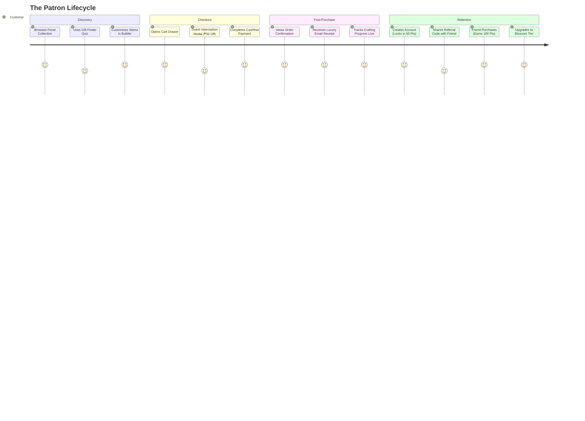

# CUSTOMER SYSTEM SPECIFICATION: The Patron Experience
**The Petal & Bloom Commerce Operating System**
**Role:** Customer Experience Architect & Frontend Systems Designer

---

## 1. Customer Philosophy: Frictionless Luxury

The Petal & Bloom customer experience balances two vital business objectives:
1. **Low Friction at Acquisition:** Guest checkout is fully supported. Customers are never forced to create an account or verify passwords before completing a gift purchase.
2. **High Incentive to Retain:** Generous welcome gifts (50 Petal Points worth ₹50), transparent crafting tracking, and referral perks encourage customers to formalize their account post-purchase.

---

## 2. Customer Lifecycle Journeys

---

## 3. The Account Portal (`/account`)

The customer account portal is organized into five luxury tabs:

### Tab 1: Orders & Studio Progress
* Displays active and completed orders with visual 4-stage crafting progress bar:
  1. *Order Confirmed* (Payment captured)
  2. *In Studio Crafting* (Yarn selected, artisan sculpting)
  3. *Packed & Inspected* (Nestled in archival postal box)
  4. *En Route / Shipped* (Courier tracking code active)
* **Itemized Visuals:** Displays arrangement thumbnail, yarn color pill, gift wrap tag, and handwritten note preview.
* **1-Click Tracking:** Links directly to live status `/track?order_id={ORDER_NUMBER}`.
* **Direct Studio Concierge:** WhatsApp button linked to customer's specific order number for seamless questions.

### Tab 2: Petal Points & Atelier Loyalty
* **Balance Display:** Total available points with INR value conversion (1 pt = ₹1).
* **Tier Status & Progress Bar:**
  * Shows current tier badge (`FLORET`, `BLOSSOM`, `HEIRLOOM`).
  * Visual progress bar showing points needed for next tier upgrade.
* **Tier Benefits Card:**
  * *Floret:* 1 point per ₹10 spent, welcome gift access.
  * *Blossom:* Priority artisan scheduling, seasonal early access.
  * *Heirloom:* Complimentary Pan-India delivery on every order, complimentary gift wrap.
* **Ledger History:** Double-entry ledger displaying date, action (e.g., "Welcome Gift", "Order Earn", "Checkout Redemption"), and points credited/debited.

### Tab 3: Referrals & Community
* **Unique Code Display:** Patron's immutable referral code (e.g., `BLOOM-9821-412`).
* **Shareable Link:** 1-click copy link that pre-populates the referral code on signup.
* **Referral Mechanics Explained:**
  * "Share with a friend: They get ₹50 off on signing up."
  * "When their first bloom is crafted and delivered, you receive 100 Petal Points (worth ₹100)!"
* **Referral Stats Counter:** Total friends invited and total points rewarded.

### Tab 4: Delivery Addresses
* Saved multi-address book allowing customers to maintain distinct addresses for Home, Office, and Gift Recipients.
* CRUD capabilities: Add new address, delete address, designate default address.

### Tab 5: Profile & Security
* Update personal details: Full Name, 10-digit Mobile Number, Email Address.
* Account security overview.
* Bi-directional protection banner: If an administrative account logs into `/account`, an amber alert informs them and redirects to `/admin/dashboard`.

---

## 4. Guest Checkout & Post-Purchase Linking

### 4.1 Frictionless Checkout
* Guest customers enter name, phone, email, and shipping address directly in `CartDrawer.tsx`.
* A gentle interception modal prompts: *"Save ₹50 on this order — Create your account or sign in to instantly unlock 50 Petal Points"*.
* If the user chooses to continue as a guest, checkout proceeds without blocking.

### 4.2 Deterministic Account Linking
* When the guest later signs up (e.g., to track order or claim loyalty points), `api/account/signup.ts` links all previous guest orders placed with that phone or email.
* Past spending immediately credits toward their lifetime points and tier progression.

---

## 5. Wishlist Synchronization

* **Anonymous Session:** Saved in browser `localStorage` via `WishlistContext.tsx`.
* **Authenticated Session:** Synchronized to database (`customer_wishlists`) so favorites persist across mobile devices and desktop browsers.
* **1-Click Move to Bag:** Patrons can move wishlisted blooms directly into their active cart drawer with one tap.
