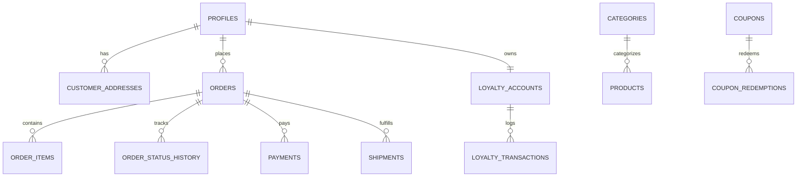

# DATABASE DOMAIN MODEL: Relational Schema & Invariants
**The Petal & Bloom Commerce Operating System**
**Database Engine:** PostgreSQL 15 (Supabase Managed)
**Role:** Principal Database Architect

---

## 1. Schema Overview

The Petal & Bloom relational schema enforces structural integrity through PostgreSQL foreign keys, check constraints, unique indexes, and triggers. 

All monetary amounts are strictly stored as **positive integers representing Paise** (1 INR = 100 Paise). This eliminates floating-point rounding errors across financial calculations.

---

## 2. Entity Specifications

### 2.1 `public.profiles`
* **Purpose:** Maps Supabase Auth identity to customer and staff profiles.
* **Columns:**
  * `id`: `uuid` PRIMARY KEY (REFERENCES `auth.users(id)` ON DELETE CASCADE).
  * `full_name`: `text` NULLABLE.
  * `phone`: `text` UNIQUE (Normalized 10 digits).
  * `email`: `text` NULLABLE.
  * `role`: `text` NOT NULL DEFAULT `'customer'` CHECK (`role IN ('customer', 'admin', 'super_admin')`).
  * `referral_code`: `text` UNIQUE (Format: `BLOOM-XXXX-XXX`).
  * `referred_by`: `text` NULLABLE (Referral code of inviter).
  * `created_at`: `timestamptz` NOT NULL DEFAULT `now()`.
  * `updated_at`: `timestamptz` NOT NULL DEFAULT `now()`.
* **Indexes:** `idx_profiles_phone`, `idx_profiles_referral_code`.
* **RLS:** Users read/update own profile; admins read all.

---

### 2.2 `public.customer_addresses`
* **Purpose:** Multi-address delivery book for patrons.
* **Columns:**
  * `id`: `uuid` PRIMARY KEY DEFAULT `gen_random_uuid()`.
  * `customer_id`: `uuid` NOT NULL REFERENCES `public.profiles(id)` ON DELETE CASCADE.
  * `recipient_name`: `text` NOT NULL.
  * `phone`: `text` NOT NULL.
  * `address_line1`: `text` NOT NULL.
  * `address_line2`: `text` NULLABLE.
  * `city`: `text` NOT NULL.
  * `state`: `text` NOT NULL.
  * `pincode`: `varchar(6)` NOT NULL.
  * `is_default`: `boolean` NOT NULL DEFAULT `false`.
  * `created_at`: `timestamptz` NOT NULL DEFAULT `now()`.
  * `updated_at`: `timestamptz` NOT NULL DEFAULT `now()`.
* **Indexes:** `idx_customer_addresses_customer`.
* **RLS:** Users manage own addresses (`customer_id = auth.uid()`).

---

### 2.3 `public.categories`
* **Purpose:** Storefront navigational and taxonomy groupings.
* **Columns:**
  * `id`: `uuid` PRIMARY KEY DEFAULT `gen_random_uuid()`.
  * `name`: `text` NOT NULL.
  * `slug`: `text` NOT NULL UNIQUE.
  * `display_order`: `integer` NOT NULL DEFAULT 0.
  * `image_url`: `text` NULLABLE.
  * `is_active`: `boolean` NOT NULL DEFAULT `true`.
  * `created_at`: `timestamptz` NOT NULL DEFAULT `now()`.
* **Indexes:** `idx_categories_display_order`.
* **RLS:** Public read; admin write.

---

### 2.4 `public.products`
* **Purpose:** Master catalog of handcrafted floral arrangements.
* **Columns:**
  * `id`: `uuid` PRIMARY KEY DEFAULT `gen_random_uuid()`.
  * `code`: `text` NOT NULL UNIQUE (SKU identifier, e.g. `ROSE-01`).
  * `name`: `text` NOT NULL.
  * `slug`: `text` NOT NULL UNIQUE.
  * `category_id`: `uuid` REFERENCES `public.categories(id)` ON DELETE SET NULL.
  * `category_slug`: `text` NOT NULL DEFAULT `'flowers'`.
  * `price_in_paise`: `integer` NOT NULL CHECK (`price_in_paise >= 0`).
  * `compare_at_price_in_paise`: `integer` NULLABLE CHECK (`compare_at_price_in_paise IS NULL OR compare_at_price_in_paise > price_in_paise`).
  * `description`: `text` NOT NULL.
  * `long_description`: `text` NULLABLE.
  * `inventory_count`: `integer` NOT NULL DEFAULT 10 CHECK (`inventory_count >= 0`).
  * `is_made_to_order`: `boolean` NOT NULL DEFAULT `true`.
  * `is_customisable`: `boolean` NOT NULL DEFAULT `false`.
  * `is_bestseller`: `boolean` NOT NULL DEFAULT `false`.
  * `is_featured`: `boolean` NOT NULL DEFAULT `false`.
  * `is_active`: `boolean` NOT NULL DEFAULT `true`.
  * `preparation_days`: `text` DEFAULT `'3–5 days'`.
  * `images`: `text[]` NOT NULL DEFAULT `'{}'`.
  * `colors`: `text[]` NOT NULL DEFAULT `'{}'`.
  * `occasions`: `text[]` NOT NULL DEFAULT `'{}'`.
  * `recipients`: `text[]` NOT NULL DEFAULT `'{}'`.
  * `created_at`: `timestamptz` NOT NULL DEFAULT `now()`.
  * `updated_at`: `timestamptz` NOT NULL DEFAULT `now()`.
* **Indexes:** `idx_products_code`, `idx_products_slug`, `idx_products_category`, `idx_products_active`.
* **RLS:** Public read for active; admin write.

---

### 2.5 `public.orders`
* **Purpose:** Authoritative purchase agreements and fulfillment records.
* **Columns:**
  * `id`: `uuid` PRIMARY KEY DEFAULT `gen_random_uuid()`.
  * `order_number`: `text` NOT NULL UNIQUE (e.g. `TPB-KT9X2-8921`).
  * `customer_id`: `uuid` REFERENCES `public.profiles(id)` ON DELETE SET NULL.
  * `guest_name`: `text` NOT NULL.
  * `guest_phone`: `text` NOT NULL.
  * `guest_email`: `text` NULLABLE.
  * `shipping_address_snapshot`: `jsonb` NOT NULL.
  * `subtotal_in_paise`: `integer` NOT NULL CHECK (`subtotal_in_paise >= 0`).
  * `discount_in_paise`: `integer` NOT NULL DEFAULT 0 CHECK (`discount_in_paise >= 0`).
  * `loyalty_discount_in_paise`: `integer` NOT NULL DEFAULT 0.
  * `loyalty_points_redeemed`: `integer` NOT NULL DEFAULT 0.
  * `shipping_fee_in_paise`: `integer` NOT NULL DEFAULT 0.
  * `total_in_paise`: `integer` NOT NULL CHECK (`total_in_paise >= 0`).
  * `order_status`: `text` NOT NULL DEFAULT `'PENDING_PAYMENT'`.
  * `payment_status`: `text` NOT NULL DEFAULT `'PENDING'`.
  * `applied_coupon_code`: `text` NULLABLE.
  * `customer_note`: `text` NULLABLE.
  * `created_at`: `timestamptz` NOT NULL DEFAULT `now()`.
  * `updated_at`: `timestamptz` NOT NULL DEFAULT `now()`.
* **Indexes:** `idx_orders_customer`, `idx_orders_phone`, `idx_orders_order_number`, `idx_orders_status`.
* **RLS:** Customers read own orders (`customer_id = auth.uid()`); admins full access.

---

### 2.6 `public.order_items`
* **Purpose:** Immutable line items for an order.
* **Columns:**
  * `id`: `uuid` PRIMARY KEY DEFAULT `gen_random_uuid()`.
  * `order_id`: `uuid` NOT NULL REFERENCES `public.orders(id)` ON DELETE CASCADE.
  * `product_id`: `uuid` REFERENCES `public.products(id)` ON DELETE SET NULL.
  * `product_code`: `text` NOT NULL.
  * `product_name`: `text` NOT NULL.
  * `unit_price_in_paise`: `integer` NOT NULL.
  * `quantity`: `integer` NOT NULL CHECK (`quantity > 0`).
  * `total_price_in_paise`: `integer` NOT NULL.
  * `selected_color`: `text` NULLABLE.
  * `gift_wrap`: `boolean` NOT NULL DEFAULT `false`.
  * `personal_message`: `text` NULLABLE.
  * `created_at`: `timestamptz` NOT NULL DEFAULT `now()`.

---

### 2.7 `public.payments`
* **Purpose:** Cashfree gateway transaction log.
* **Columns:**
  * `id`: `uuid` PRIMARY KEY DEFAULT `gen_random_uuid()`.
  * `order_id`: `uuid` NOT NULL REFERENCES `public.orders(id)` ON DELETE CASCADE.
  * `provider`: `text` NOT NULL DEFAULT `'CASHFREE'`.
  * `cf_order_id`: `text` NOT NULL UNIQUE.
  * `cf_payment_id`: `text` NULLABLE.
  * `amount_in_paise`: `integer` NOT NULL.
  * `status`: `text` NOT NULL DEFAULT `'PENDING'`.
  * `payment_method`: `text` NULLABLE.
  * `payment_details`: `jsonb` NULLABLE.
  * `created_at`: `timestamptz` NOT NULL DEFAULT `now()`.
  * `updated_at`: `timestamptz` NOT NULL DEFAULT `now()`.

---

### 2.8 `public.loyalty_accounts` & `public.loyalty_transactions`
* **Purpose:** Double-entry ledger tracking customer Petal Points.
* **`loyalty_accounts`:** `customer_id` PK, `points_balance`, `lifetime_points_earned`, `tier`.
* **`loyalty_transactions`:** `id` PK, `customer_id`, `order_id`, `type` (`EARN_PURCHASE`, `REDEEM_PURCHASE`, `WELCOME_BONUS`, `REFERRAL_BONUS`, `ADMIN_CREDIT`, `ADMIN_DEBIT`, `REFUND_RESTORE`), `points`, `description`, `created_at`.

---

### 2.9 `public.shipments` & `public.shipment_events`
* **Purpose:** Courier tracking and dispatch lifecycle.
* **`shipments`:** `order_id` FK, `carrier` (`SHIPROCKET`, `DELHIVERY`, `INDIA_POST`, `MANUAL`), `awb_number`, `tracking_url`, `status`, `estimated_delivery_date`.
* **`shipment_events`:** Milestone updates with `status`, `location`, `description`, `occurred_at`.

---

### 2.10 `public.audit_logs`
* **Purpose:** Tamper-resistant log of administrative modifications.
* **Columns:** `id`, `actor_id`, `actor_role`, `action`, `entity`, `entity_id`, `details` (JSONB), `ip_address`, `created_at`.
* **RLS:** Insert restricted to service role / admin; updates and deletes disallowed.
