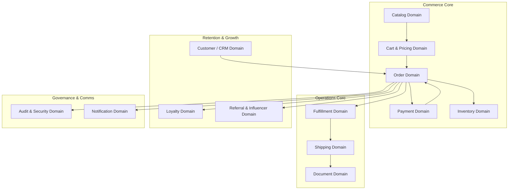

# DOMAIN MODEL: Bounded Contexts & Aggregate Roots
**The Petal & Bloom Commerce Operating System**
**Role:** Principal Domain Architect

---

## 1. High-Level Bounded Contexts

The Petal & Bloom Commerce OS is organized into 12 distinct bounded contexts:

---

## 2. Deep Domain Breakdown

### 2.1 Customer / CRM Domain
* **Aggregate Root:** `CustomerProfile` (`profiles`)
* **Entities:** `CustomerAddress`, `LoyaltyAccount`
* **Ownership:** Owns customer identity, authentication mapping, address book, and contact preferences.
* **Important Invariants:**
  * Phone number must be normalized to 10 digits and unique across all customer profiles.
  * An account cannot have a negative loyalty points balance.
* **Domain Events Published:** `CustomerRegisteredEvent`, `CustomerAddressAddedEvent`.
* **Dependencies:** Supabase Auth (`auth.users`).

### 2.2 Catalog Domain
* **Aggregate Root:** `Product` (`products`)
* **Entities:** `Category`, `ProductImage`, `ProductColor`
* **Ownership:** Owns arrangement titles, descriptions, SKU codes, pricing, dimensions, and marketing tags.
* **Important Invariants:**
  * `code` and `slug` must be globally unique.
  * `price_in_paise` must be $\ge 0$.
  * `compare_at_price_in_paise`, if defined, must be $> \text{price\_in\_paise}$.
* **Domain Events Published:** `ProductPublishedEvent`, `ProductPriceChangedEvent`, `ProductDeactivatedEvent`.
* **Dependencies:** Supabase Storage (`product-images`).

### 2.3 Cart & Pricing Domain
* **Aggregate Root:** `CartSession` (Ephemeral client-state + server validation)
* **Entities:** `CartItem`, `CartAddOn`, `CartDiscount`
* **Ownership:** Owns item bundling, gift wrap fee calculations, shipping fee rules, and coupon eligibility checks.
* **Important Invariants:**
  * Client cannot submit prices; prices are fetched dynamically from Catalog Domain.
  * Free shipping threshold strictly enforced at ₹1,200.
* **Domain Events Published:** `CheckoutInitiatedEvent`.
* **Dependencies:** Catalog Domain, Coupon Domain, Loyalty Domain.

### 2.4 Order Domain
* **Aggregate Root:** `Order` (`orders`)
* **Entities:** `OrderItem`, `OrderStatusHistory`
* **Ownership:** Authoritative record of purchase agreement. Owns the order lifecycle state machine.
* **Important Invariants:**
  * Order cannot transition to `SHIPPED` without an assigned carrier and AWB.
  * Order cannot transition to `ORDER_CONFIRMED` without verified payment.
  * Line item unit prices and titles are immutable snapshots.
* **Domain Events Published:** `OrderCreatedEvent`, `OrderConfirmedEvent`, `OrderFulfillmentUpdatedEvent`, `OrderCancelledEvent`.
* **Dependencies:** Customer Domain, Payment Domain, Inventory Domain.

### 2.5 Payment Domain
* **Aggregate Root:** `Payment` (`payments`)
* **Entities:** `PaymentEvent` (Webhook Idempotency Log)
* **Ownership:** Owns Cashfree gateway sessions, transaction logs, and refund execution.
* **Important Invariants:**
  * Webhook signatures must match HMAC-SHA256 hash.
  * Duplicate webhook events must not execute business logic twice.
  * Refunds cannot exceed original captured order amount.
* **Domain Events Published:** `PaymentCapturedEvent`, `PaymentFailedEvent`, `RefundProcessedEvent`.
* **Dependencies:** Cashfree Payments API.

### 2.6 Inventory Domain
* **Aggregate Root:** `InventoryItem` (Tracked via `products.inventory_count` & `is_made_to_order`)
* **Ownership:** Owns available-to-promise (ATP) stock levels and made-to-order lead times.
* **Important Invariants:**
  * Ready-to-ship stock cannot decrement below 0.
  * Cancelled orders must restore inventory atomically.
* **Domain Events Published:** `StockDepletedEvent`, `StockRestoredEvent`.
* **Dependencies:** Catalog Domain, Order Domain.

### 2.7 Fulfillment Domain
* **Aggregate Root:** `WorkOrder` (Studio Crafting Queue)
* **Entities:** `ArtisanQueueItem`, `InspectionChecklist`
* **Ownership:** Owns studio handcrafting schedules, stem assembly instructions, and packaging verification.
* **Important Invariants:**
  * Custom gift message must be reviewed and checked before box sealing.
* **Domain Events Published:** `CraftingStartedEvent`, `PackagingCompletedEvent`.
* **Dependencies:** Order Domain.

### 2.8 Shipping Domain
* **Aggregate Root:** `Shipment` (`shipments`)
* **Entities:** `ShipmentEvent` (Courier Milestone)
* **Ownership:** Owns courier partner assignments, AWB tracking allocations, and delivery milestone logs.
* **Important Invariants:**
  * Tracking URL must be valid for the assigned carrier.
* **Domain Events Published:** `ShipmentDispatchedEvent`, `ShipmentDeliveredEvent`, `ShipmentExceptionEvent`.
* **Dependencies:** Logistics APIs (Shiprocket, Delhivery, India Post).

### 2.9 Loyalty Domain
* **Aggregate Root:** `LoyaltyAccount` (`loyalty_accounts`)
* **Entities:** `LoyaltyTransaction` (`loyalty_transactions`)
* **Ownership:** Owns double-entry points ledger and tier designation.
* **Important Invariants:**
  * Points balance must equal sum of all unexpired transaction points.
  * Tier designation must strictly match lifetime earned points:
    $$\text{Tier} = \begin{cases} \text{HEIRLOOM}, & \text{if lifetime} \ge 1500 \\ \text{BLOSSOM}, & \text{if lifetime} \ge 500 \\ \text{FLORET}, & \text{otherwise} \end{cases}$$
* **Domain Events Published:** `PointsEarnedEvent`, `PointsRedeemedEvent`, `TierUpgradedEvent`.
* **Dependencies:** Order Domain, Customer Domain.

### 2.10 Referral & Influencer Domain
* **Aggregate Root:** `Referral` (`referrals`), `Coupon` (`coupons`)
* **Ownership:** Owns referral attribution, anti-fraud matching, and affiliate commission tracking.
* **Important Invariants:**
  * A customer cannot refer themselves (phone, email, or device matching blocks reward).
  * Referral rewards only distribute upon delivery of the referee's first purchase.
* **Domain Events Published:** `ReferralRewardedEvent`.
* **Dependencies:** Customer Domain, Order Domain.

### 2.11 Notification Domain
* **Aggregate Root:** `NotificationDispatch` (Email / WhatsApp message)
* **Ownership:** Owns customer communication templates and delivery confirmations.
* **Important Invariants:**
  * Customer must receive an email confirmation upon payment and upon dispatch.
* **Domain Events Published:** `NotificationSentEvent`, `NotificationFailedEvent`.
* **Dependencies:** Resend Email API, WhatsApp Web.

### 2.12 Audit & Security Domain
* **Aggregate Root:** `AuditLog` (`audit_logs`)
* **Ownership:** Owns immutable records of all administrative actions and security mutations.
* **Important Invariants:**
  * Audit logs can never be updated or deleted by any administrative role (Append-only).
* **Domain Events Published:** `SecurityViolationEvent`.
* **Dependencies:** PostgreSQL engine.
