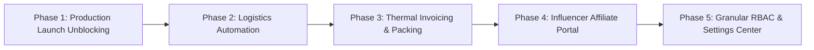

# IMPLEMENTATION ROADMAP FOR GEMINI: Engineering Contract
**The Petal & Bloom Commerce Operating System**
**Target Executor:** Implementation AI Engineer
**Architectural Baseline:** Commit `1e12a4c` (Vite + React 18 + Supabase + Vercel Serverless)

---

## 1. Operating Instructions for Implementation AI

This document is your **binding implementation contract**. 

### Rules of Engagement:
1. **Zero Architecture Drift:** Do not reinvent table schemas, service boundaries, or design tokens. Follow the specifications in `docs/` exactly.
2. **Preserve What Works:** The existing storefront, brand styling (`linen`, `bark`, `rose`, `canvas`), and core order creation pipeline (`api/checkout/create-order.ts`) are production-grade. Build *on top* of them; do not refactor them arbitrarily.
3. **Phase-by-Phase Verification:** Complete each phase sequentially. Verify with `npm run build` and automated test runs before advancing.

---

## 2. Phase-by-Phase Implementation Blueprint

---

### PHASE 1: Production Launch Unblocking & Cashfree Go-Live
* **Objective:** Transition from sandbox simulation to live financial processing with live credentials and verified email delivery.
* **Preconditions:** Human owner provides live Cashfree App ID and Secret Key; live Resend API key configured.
* **Files / Areas to Modify:**
  * `.env` & Vercel Project Environment Variables.
  * `src/lib/cashfree.ts` (Set mode to `'production'`).
  * `api/lib/cashfreeServer.ts` (Point to `https://api.cashfree.com/pg`).
* **Database Changes:** None.
* **Integrations:** Cashfree Production Gateway, Resend Production API.
* **Security Checks:** Verify webhook HMAC signature matches production secret.
* **Tests:** Run end-to-end checkout with ₹1 real transaction test. Verify funds captured in Cashfree merchant dashboard and email received in customer inbox.
* **Rollback Strategy:** Revert `.env` variables back to test keys.

---

### PHASE 2: Logistics Automation (Shiprocket API Connector)
* **Objective:** Replace manual AWB number entry with 1-click automated courier booking and label generation via Shiprocket API.
* **Preconditions:** Shiprocket account credentials (`SHIPROCKET_EMAIL`, `SHIPROCKET_PASSWORD`).
* **Files to Create / Modify:**
  * `api/lib/shiprocketService.ts` (New Shiprocket token authentication & order creation wrapper).
  * `api/orders/ship.ts` (New serverless endpoint: `POST /api/orders/ship` creating ad-hoc shipment).
  * `src/pages/admin/AdminOrders.tsx` (Add "Auto-Book via Shiprocket" button in fulfillment modal).
* **Database Changes:**
  * Ensure `shipments.shipping_label_url` and `shipments.weight_in_grams` are populated from API response.
* **Tests:** Book a test shipment in Shiprocket sandbox. Verify AWB code and courier name are returned and saved to database.
* **Acceptance Criteria:** Operator clicks "Auto-Book Shiprocket" -> AWB code is instantly populated, tracking link generated, and shipping label URL stored.

---

### PHASE 3: Thermal Packing Slip & Invoice Print Station
* **Objective:** Enable 1-click printing of 4x6" thermal courier packing slips with itemized stem checklists and customer handwritten card messages.
* **Preconditions:** Phase 1 and 2 completed.
* **Files to Create / Modify:**
  * `src/components/admin/PackingSlipModal.tsx` (New component styled with `@media print`).
  * `src/components/admin/InvoiceModal.tsx` (New printable A4 tax invoice component).
  * `src/pages/admin/AdminOrders.tsx` (Add "Print Slip" and "Print Invoice" action buttons).
* **CSS / Print Architecture:**
  * `@page { size: 4in 6in; margin: 0; }` for thermal labels.
  * Vector barcode generation using lightweight SVG library (`jsbarcode`).
* **Tests:** Trigger print dialog in Google Chrome. Verify layout fits cleanly on 4x6" label preview with zero pagination overflow.
* **Acceptance Criteria:** Packing slip displays order number barcode, recipient address, stem list with yarn colors, and personalized gift note.

---

### PHASE 4: Influencer Affiliate Portal & Abandoned Carts
* **Objective:** Surface influencer performance metrics and abandoned cart recovery triage in the admin portal.
* **Files to Create / Modify:**
  * `src/pages/admin/AdminInfluencers.tsx` (New screen at `/admin/influencers`).
  * `src/pages/admin/AdminAbandonedCarts.tsx` (New screen at `/admin/abandoned-carts`).
  * `src/components/AdminLayout.tsx` (Add navigation links for Influencers and Abandoned Carts).
  * `src/App.tsx` (Register new administrative routes).
* **Database Queries:**
  * Query `orders` where `order_status = 'PENDING_PAYMENT'` and `created_at < now() - INTERVAL '1 hour'` for abandoned carts.
  * Query `coupons` where `is_influencer = true` joined with `coupon_redemptions` for affiliate GMV.
* **Acceptance Criteria:** Marketer can view GMV and commission due per influencer; operator can view abandoned carts with customer phone numbers and 1-click recovery WhatsApp link.

---

### PHASE 5: Granular RBAC & Centralized Settings Center
* **Objective:** Enforce role-based access control across staff accounts and centralize configurable business settings.
* **Files to Create / Modify:**
  * `src/pages/admin/AdminSettings.tsx` (Expand beyond categories to full store settings).
  * `supabase/migrations/20260928000008_settings_and_rbac.sql` (Settings table & Super Admin functions).
* **Settings Controlled:** Free shipping minimum spend, standard shipping rate, Petal Points earn ratio, GST number, store address.
* **Tests:** Log in with an account having `role = 'customer'` and verify access to `/admin/*` is blocked. Log in as `admin` and verify refund buttons are restricted.
* **Acceptance Criteria:** Super admin can update free shipping threshold; checkout immediately reflects the updated threshold without redeploying code.
