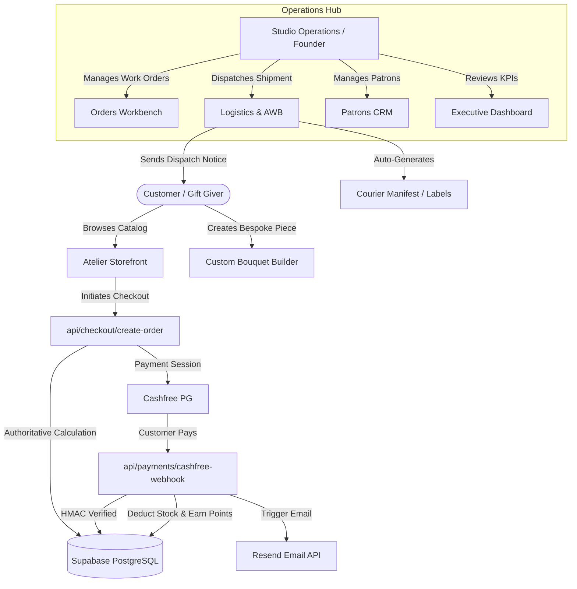
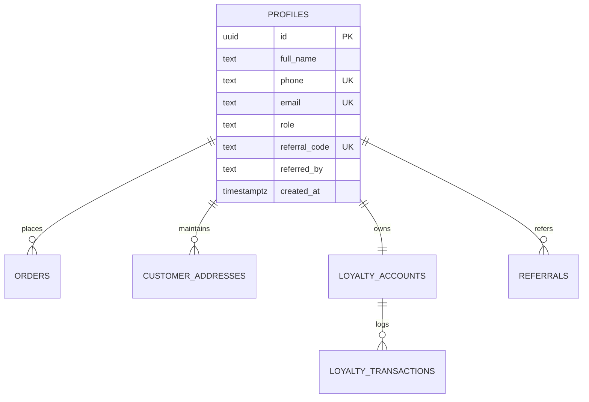
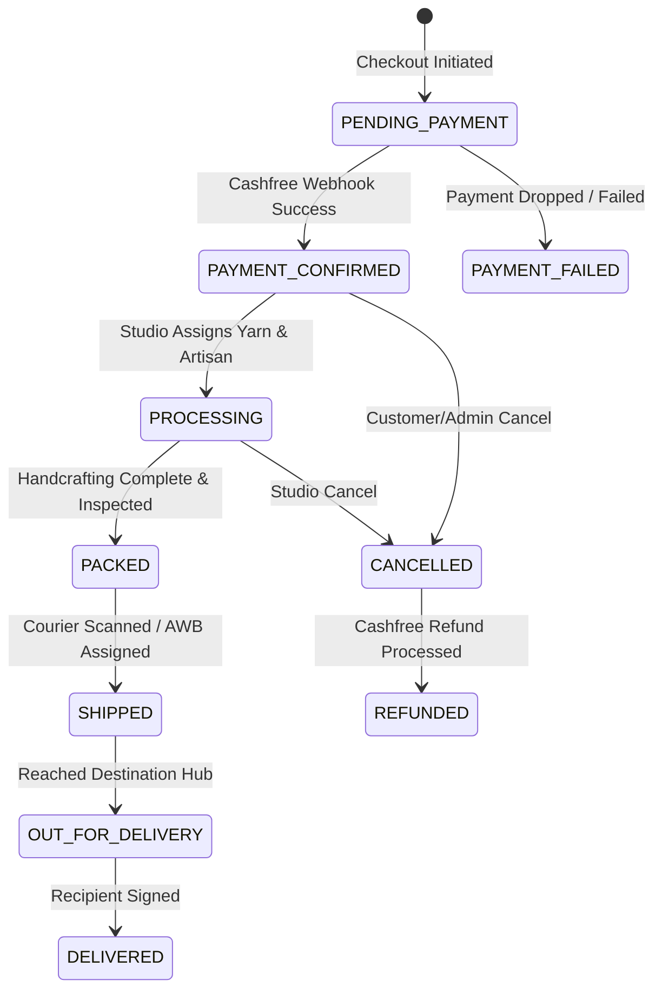

# MASTER BACKOFFICE ARCHITECTURE: The Petal & Bloom Commerce OS
**System Specification & Operational Architecture**
**Project:** The Petal & Bloom (`thepetalandbloom.in`)
**Target Stack:** Vite / React 18 + Vercel Serverless Functions + Supabase (PostgreSQL 15 + RLS + Auth + Storage)
**Target Payment Gateway:** Cashfree PG (Production)
**Target Courier Network:** Shiprocket / Delhivery / India Post

---

## 1. Executive Summary

The Petal & Bloom Commerce Operating System is a unified, high-integrity architecture engineered to run an artisan D2C luxury floral brand. Rather than treating the platform as a static storefront with disconnected admin pages, this architecture establishes an authoritative single source of truth across customer relationships (CRM), order fulfillment, artisan handcrafting schedules, multi-carrier shipping, financial reconciliation, and loyalty retention.

The platform separates the **Customer Storefront** (an aesthetic, high-conversion Atelier experience) from the **Operations Command Center** (a resilient workbench for business operations, packing stations, and customer concierge).

---

## 2. Current Backend State

The backend resides in `/api` as Vercel serverless TypeScript functions with Supabase as the managed PostgreSQL database.

* **Database Engine:** Supabase PostgreSQL with `pgcrypto` enabled.
* **Authentication:** Supabase Auth (JWT based), augmented with `profiles.role` (`'customer'`, `'admin'`, `'super_admin'`).
* **Serverless Runtime:** Node.js 18+ serverless endpoints in `/api`.
* **Database Access:** Dual-client model:
  * Client-side: `src/lib/supabaseClient.ts` using `VITE_SUPABASE_ANON_KEY` restricted by strict Row Level Security (RLS).
  * Server-side: `api/lib/supabaseServer.ts` using `SUPABASE_SERVICE_ROLE_KEY` for authoritative mutations.
* **Payment Integration:** Cashfree PG drop-in SDK client-side with HMAC-SHA256 signature verification server-side.
* **Email System:** Resend HTTPS API via `api/lib/emailService.ts` for order confirmations and dispatch notices.

---

## 3. Existing Admin Capabilities

The current repository contains the following functional administrative screens in `src/pages/admin/` and `src/pages/`:

1. **Atelier Overview Dashboard (`src/pages/AdminDashboard.tsx`):**
   * Real-time calculation of Gross Captured Revenue, Active Orders count, Average Order Value (AOV), and Patron count.
   * Recent orders feed with status badges and one-click inspection.
   * Studio inventory overview with search, bestseller flags, and quick deletion.
2. **Orders Workbench (`src/pages/admin/AdminOrders.tsx`):**
   * Order list with status filters (`ALL`, `PAYMENT_CONFIRMED`, `PROCESSING`, `PACKED`, `SHIPPED`, `DELIVERED`, `CANCELLED`).
   * Search by order number, customer name, phone number, or coupon code.
   * Shipment management: Carrier assignment (`SHIPROCKET`, `DELHIVERY`, `INDIA_POST`, `MANUAL`), AWB tracking entry, tracking URL generation.
   * "Save & Notify" workflow triggering customer dispatch email and opening pre-formatted WhatsApp Concierge dispatch link.
   * Order status history audit logging.
3. **Patrons CRM & Loyalty Ledger (`src/pages/admin/AdminCustomers.tsx`):**
   * Searchable patron archive with tier filters (`FLORET`, `BLOSSOM`, `HEIRLOOM`).
   * Customer modal displaying order history, saved addresses, and complete loyalty points transaction ledger.
   * Administrative points adjustment form (credit/debit with audit reason).
   * One-click CSV export of customer database.
   * Direct WhatsApp link to customer mobile.
4. **Product Editor (`src/pages/AdminEditor.tsx`):**
   * Comprehensive CRUD form with live preview.
   * Image uploads directly to Supabase Storage `product-images` bucket.
   * Multi-select for colors, gifting occasions, recipients, and what's included.
5. **Promotions & Coupons (`src/pages/admin/AdminCoupons.tsx`):**
   * Create percentage and flat coupons with usage limits, expiry dates, and min spend thresholds.
   * Active/inactive toggle and deletion.
6. **Site Visuals CMS (`src/pages/admin/AdminAssets.tsx`):**
   * Media management for hero images, occasion banners, and section photography stored in Supabase `site-assets` bucket.
7. **Navigation Manager (`src/pages/admin/AdminNavigation.tsx`):**
   * Menu hierarchy editor for storefront header and category dropdowns.
8. **Category Settings (`src/pages/admin/AdminSettings.tsx`):**
   * Category creation, slug generation, and display ordering.

---

## 4. Existing Gaps Identified

While the foundation is strong, several gaps prevent it from acting as an autonomous business operating system:

1. **No Live Cashfree Credentials:** Currently running in sandbox / test mode.
2. **Missing Automated Shiprocket API Connector:** Carrier AWBs and tracking numbers are entered manually rather than fetched via API.
3. **No Automated Invoicing / Thermal Packing Slips:** Printable invoices and 4x6" thermal labels must be generated.
4. **No Influencer Affiliate Portal:** Influencer tracking exists in the coupon schema (`is_influencer`, `commission_percent`) but lacks an admin dashboard.
5. **No Abandoned Cart Recovery Automation:** Guest checkouts capture phone and email, but abandoned cart triage is manual.
6. **No Granular Staff RBAC:** Roles are currently coarse (`admin` vs `customer`); no separation between Studio Artisan, Packing Clerk, and Super Admin.
7. **No Centralized Settings Interface:** Tax rules, free shipping thresholds, and brand policies are hardcoded across components rather than managed in a settings table.

---

## 5. Business Operating Model



---

## 6. Domain Architecture

The system is decomposed into 12 distinct, decoupled domain models:

1. **Identity & Auth Domain:** User authentication, passwordless access, staff roles, and permission gates.
2. **Catalog Domain:** Categories, floral species, product specifications, color palettes, and seasonal collections.
3. **Cart & Pricing Domain:** Authoritative pricing engine, add-on bundling, tax estimation, and gift wrapping rules.
4. **Order Domain:** Order aggregate root, line items, state machine transitions, and status audit histories.
5. **Payment Domain:** Gateway sessions, transactions, webhook event deduplication, and refund handling.
6. **Inventory Domain:** Finished goods stock, made-to-order lead time calculations, and reservation locks.
7. **Fulfillment Domain:** Handcrafting work orders, artisan queues, and packaging inspection checklists.
8. **Shipping Domain:** Carrier abstraction, AWB allocation, tracking events, and RTO alerts.
9. **Loyalty & Referral Domain:** Double-entry Petal Points ledger, tier calculations, and referral attribution.
10. **Marketing & Promotions Domain:** Coupons, influencer attribution, and abandoned cart sessions.
11. **Communication Domain:** Transactional HTML emails, WhatsApp Concierge links, and SMS gateways.
12. **Audit & Observability Domain:** Administrative action logs, webhook telemetry, and slow query monitors.

---

## 7. Admin Information Architecture (Navigation Tree)

```
[Atelier Admin Portal]
│
├── 📊 Dashboard (/admin/dashboard)
│     └── Executive Overview, Revenue KPIs, Active Work Orders, Recent Feed
│
├── 📦 Orders & Shipments (/admin/orders)
│     ├── Order Workbench (Filter by Payment / Crafting / Shipping Status)
│     ├── Order Detail Drawer (Customer 360, Items, Timeline, Packing Slip)
│     └── Logistics & Tracking (Carrier assignment, AWB, Dispatch)
│
├── 👥 Patrons & CRM (/admin/customers)
│     ├── Patron Directory (Search, Tier filter, LTV sort, CSV Export)
│     └── Patron Detail Modal (Full Order History, Address Book, Points Ledger)
│
├── 🌸 Studio Catalog
│     ├── Pieces & Inventory (/admin/dashboard#catalog)
│     ├── Add / Edit Piece (/admin/editor)
│     └── Category Manager (/admin/settings)
│
├── 🏷️ Promotions & Growth
│     ├── Coupons & Vouchers (/admin/coupons)
│     ├── Influencer Affiliates (/admin/influencers - Future)
│     └── Loyalty & Petal Points (/admin/customers#loyalty)
│
├── 🎨 Creative & Content
│     ├── Studio Visuals CMS (/admin/assets)
│     └── Navigation Menus (/admin/navigation)
│
└── ⚙️ System & Governance
      ├── Audit Log Explorer (/admin/audit-logs - Future)
      └── Atelier Configuration (/admin/configuration - Future)
```

---

## 8. Customer Information Architecture

* **Storefront:** Homepage (`/`), Collection Shop (`/shop`), Piece Detail (`/product/:code`).
* **Bespoke Co-Creation:** Custom Bouquet Builder (`/custom-bouquet`), Gift Finder (`/gift-finder`), Custom Inquiries (`/custom`).
* **Checkout Journey:** Slide-in Bag (`CartDrawer.tsx`), Checkout Form (Saved address selector, PIN validator, Cashfree Drop-in).
* **Post-Purchase:** Confirmation Page (`/order-confirmation`), Live Tracking (`/track`).
* **Patron Account (`/account`):**
  * *Tab 1: Orders* (Active crafting timeline, item thumbnails, invoice download).
  * *Tab 2: Petal Points* (Current balance, tier progress bar, transaction ledger).
  * *Tab 3: Referrals* (Unique referral code, shareable link, rewards summary).
  * *Tab 4: Address Book* (Add, edit, delete, default toggle).
  * *Tab 5: Profile* (Name, phone, email, security).

---

## 9. CRM Architecture (Customer 360)

Customer identity is resolved by normalizing both `phone` (10-digit Indian standard) and `email`. Guest checkouts automatically link to existing accounts when registered.



The CRM view computes:
* **Lifetime Value (LTV):** Sum of all completed order totals.
* **Average Order Value (AOV):** Total spend / Total completed orders.
* **Recency & Frequency:** Days since last purchase and total order count.
* **Tier Designation:** Automatic progression (`FLORET` < 500, `BLOSSOM` 500–1499, `HEIRLOOM` 1500+).

---

## 10. Order Management Architecture

### Order State Machine



Every transition writes an immutable audit record to `order_status_history` capturing `previous_status`, `new_status`, `note`, `created_by`, and `timestamp`.

---

## 11. Payment Operations & Reconciliation

* **Provider:** Cashfree Payments Gateway.
* **Currencies:** INR exclusively.
* **Security:** All webhook payloads must verify:
  $$\text{HMAC-SHA256}(\text{timestamp} + \text{rawBody}, \text{webhookSecret}) == \text{signature}$$
* **Idempotency:** Unique composite key `eventType_orderId_cfPaymentId` logged in `payment_events`. If `is_processed = true`, duplicate webhooks return `200 OK` immediately without re-crediting points or decrementing stock.
* **Reconciliation States:** `PENDING`, `SUCCESS`, `FAILED`, `REFUNDED`.
* **Refund Pipeline:** `api/payments/refund.ts` calls Cashfree Refund API, updates order to `REFUNDED`, restores inventory, and logs audit notes.

---

## 12. Inventory Management

The Petal & Bloom operates on a **hybrid inventory model**:

1. **Studio Stock (Ready-to-Ship):** Physical stock tracked via `products.inventory_count`. When an order is paid, stock decrements atomically:
   ```sql
   UPDATE public.products 
   SET inventory_count = GREATEST(0, inventory_count - item_quantity) 
   WHERE id = item_product_id;
   ```
2. **Made-to-Order (MTO):** Flagged via `is_made_to_order = true`. These pieces do not block checkout when stock is 0. Instead, lead times are calculated dynamically based on `preparation_days` (e.g., "3–5 days crafting").
3. **Restoration on Cancellation:** When `api/orders/cancel.ts` is triggered, inventory is safely incremented back to `products.inventory_count`.

---

## 13. Fulfillment Workflow

```
[Order Confirmed]
       │
       ▼
[Artisan Queue] ───► Prints Stem Picking Sheet (Flower count & Yarn shades)
       │
       ▼
[Quality Inspection] ───► Verifies Stem Dimensions, Petal Tightness & Wiring
       │
       ▼
[Packing Station] ───► Prints 4x6" Thermal Slip & Personal Handwritten Card
       │
       ▼
[Courier Box Sealed] ───► Ties Archival Ribbon, Seals Moisture Barrier
```

---

## 14. Shipping & Carrier Abstraction

A unified interface (`src/services/shippingService.ts`) abstracts carrier specifics:

* **Supported Carriers:** `DELHIVERY`, `SHIPROCKET`, `INDIA_POST`, `MANUAL`.
* **URL Generation:**
  * Delhivery: `https://www.delhivery.com/track/package/{AWB}`
  * Shiprocket: `https://shiprocket.co//tracking/{AWB}`
  * India Post: `https://www.indiapost.gov.in/...consignmentNumber={AWB}`
* **Shipping Pricing Tier:**
  * Subtotal $\ge$ ₹1,200: **Complimentary Delivery**
  * Subtotal $\ge$ ₹799: **₹49 Reduced Delivery**
  * Subtotal < ₹799: **₹69 Standard Atelier Delivery**

---

## 15. Promotions & Coupon Engine

* **Discount Types:**
  * `PERCENT`: e.g., 10% off, subject to `max_discount_in_paise` cap.
  * `FLAT`: e.g., ₹200 off, minimum cart value enforced via `min_order_in_paise`.
* **Rules & Constraints:** Expiration timestamp, global usage limits, and per-customer limits (`per_customer_limit = 1`).
* **Authoritative Server Validation:** `api/coupons/validate.ts` recalculates discount server-side; client manipulation is mathematically impossible.

---

## 16. Loyalty System (Petal Points)

* **Base Earning:** 1 Petal Point per ₹10 spent on confirmed orders.
* **Welcome Gift:** 50 Petal Points automatically credited on customer registration.
* **Redemption Value:** 1 Petal Point = ₹1 INR direct checkout discount.
* **Tiers & Progression:**
  * **Floret (0–499 pts):** Standard earn rate, welcome access.
  * **Blossom (500–1499 pts):** Priority studio crafting, seasonal preview access.
  * **Heirloom (1500+ pts):** Complimentary shipping on all orders, VIP concierge.
* **Double-Entry Ledger:** All adjustments recorded in `loyalty_transactions` with `customer_id`, `points` (positive or negative), `type`, and `description`.

---

## 17. Referral Engine

* **Mechanism:** Every customer is assigned an immutable referral code (`BLOOM-XXXX-XXX`).
* **Attribution:** New patrons enter code during registration; recorded in `profiles.referred_by` and `referrals` table.
* **Reward Trigger:** Upon successful delivery of referee's first order, referrer receives **100 Petal Points (₹100 value)** via `REFERRAL_BONUS`.

---

## 18. Influencer Affiliate System

* **Schema Support:** Built into `coupons` table via `is_influencer = true`, `influencer_name`, and `commission_percent`.
* **Attribution:** Any order redeeming an influencer's code tags the order and computes commission tracking in real time.
* **Reporting:** Aggregates gross revenue, discount provided, and commission due per influencer code.

---

## 19. Reviews & User-Generated Content (UGC)

* **Architecture:** Moderated review model linked to `product_code` and `customer_id`.
* **Verified Purchase Badge:** Cross-referenced against `orders` table to guarantee review authenticity.
* **Moderation Pipeline:** Reviews default to `is_approved = false` until approved by the admin.

---

## 20. Abandoned Cart Recovery

* **Lead Capture:** Checkout Step 1 captures phone and email before launching payment modal.
* **Incomplete Order Tracking:** Orders created with `order_status = 'PENDING_PAYMENT'` represent active checkout sessions.
* **Triage Window:** Sessions remaining unpaid after 60 minutes are marked as abandoned and surfaced in the admin recovery view.

---

## 21. Notification Architecture

* **Transactional Email:** Powered by Resend API via `api/lib/emailService.ts`:
  * *Order Confirmation:* High-fidelity HTML receipt with itemized cards.
  * *Dispatch Notice:* Shipping confirmation with live tracking link and AWB.
* **WhatsApp Concierge:** Deep-link generation pre-populating mobile number and structured milestone message.

---

## 22. Documents, Receipts & Invoicing

* **Order Confirmation:** In-app visual receipt accessible via `/track?order_id=...`.
* **Tax Invoice:** Printable HTML/CSS invoice compliant with Indian commercial standards (Order number, date, customer address, line items, CGST/SGST/IGST breakdown, total).
* **Thermal Packing Slip:** 4x6" print layout showing shipping address, item codes, yarn shades, and personalized gift card message.

---

## 23. Data Export & Import Engine

* **CSV Export:** Client-side generation with proper RFC 4180 escaping for:
  * Customer base with spend and loyalty metrics.
  * Order dispatch manifests.
  * Product inventory lists.
* **Safety:** PII is sanitized; financial card numbers or sensitive tokens are never exported.

---

## 24. Reporting & Business Intelligence

The system produces four core reports:
1. **Financial Sales Report:** Gross merchandise value, coupon discounts, Petal Points redeemed, net revenue, and shipping fees.
2. **Product Performance Report:** Units sold, revenue per arrangement, and return rates.
3. **Logistics SLA Report:** Time from payment confirmation to dispatch, carrier transit duration, and delivery completion rates.
4. **Loyalty Liability Report:** Total points issued, points redeemed, and outstanding points liability in INR.

---

## 25. Storefront Analytics & Tracking

* **Google Analytics 4 (GA4):** Initialized in `index.html` via `window.dataLayer`.
* **Event Taxonomy (`src/utils/analytics.ts`):** `homepage_view`, `product_view`, `search`, `filter_use`, `quick_view`, `add_to_cart`, `checkout_started`, `purchase_completed`, `wishlist_add`.
* **Server-Side Tracking:** Authoritative transaction totals tracked at payment webhook resolution.

---

## 26. Staff Roles & Authorization

The system enforces three primary access tiers:

| Role | Access Scope |
| :--- | :--- |
| **Super Admin / Owner** | Full system access: Financial reports, refunds, staff management, settings, product pricing, database exports. |
| **Studio Operations / Artisan** | Order workbench, fulfillment status updates, packing slip printing, inventory view, product creation/editing. |
| **Customer Concierge** | Patron lookup, order tracking lookup, WhatsApp messaging, read-only loyalty views. |

---

## 27. Permission Matrix

```
[Capability]                 Super Admin   Operations   Concierge
orders.read                       ✅           ✅           ✅
orders.update_status              ✅           ✅           ❌
orders.refund                     ✅           ❌           ❌
products.write                    ✅           ✅           ❌
customers.read                    ✅           ✅           ✅
customers.adjust_points           ✅           ❌           ❌
customers.export                  ✅           ❌           ❌
coupons.manage                    ✅           ❌           ❌
settings.manage                   ✅           ❌           ❌
```

---

## 28. Audit Logging Specification

All administrative state modifications write to `public.audit_logs`:
* `actor_id`: UUID of admin user from `auth.users`.
* `actor_role`: Role at time of action.
* `action`: Action verb (e.g., `ORDER_STATUS_UPDATE`, `POINTS_ADJUSTMENT`, `REFUND_ISSUED`).
* `entity`: Affected table name (`orders`, `products`, `loyalty_accounts`).
* `entity_id`: Identifier of affected record.
* `details`: JSONB snapshot of before/after values and reason string.
* `created_at`: Immutable UTC timestamp.

---

## 29. Settings & Centralized Configuration

System parameters are maintained in code configurations with database overrides:
* `STORE_NAME`: "The Petal & Bloom"
* `FREE_SHIPPING_THRESHOLD_PAISE`: `120000` (₹1,200)
* `STANDARD_SHIPPING_FEE_PAISE`: `6900` (₹69)
* `REDUCED_SHIPPING_FEE_PAISE`: `4900` (₹49)
* `PETAL_POINTS_EARN_RATIO`: `1000` (1 pt per ₹10 spent)
* `WELCOME_BONUS_POINTS`: `50`
* `REFERRAL_BONUS_POINTS`: `100`

---

## 30. Scoped Administrative Search

Search utilities are scoped by domain for maximum performance:
* **Order Search:** Exact match on `order_number`, ILIKE match on `guest_name`, `guest_phone`, `applied_coupon_code`.
* **Patron Search:** ILIKE match on `full_name`, `email`, `phone`, and `referral_code`.
* **Catalog Search:** ILIKE match on `name`, `code`, `category_slug`, `occasions`.

---

## 31. System Health & Observability

* **Health Indicators:**
  * Supabase database connection and query latency.
  * Cashfree webhook receipt rate and verification failures.
  * Email delivery error rates logged to console.
* **Error Boundaries:** React error boundaries wrapping main application routes to prevent blank screen crashes.

---

## 32. Security Threat Model & Mitigations

| Threat Vector | Mitigation Strategy |
| :--- | :--- |
| **Client-Side Price Tampering** | Complete recalculation of catalog prices, discounts, and shipping server-side in `api/checkout/create-order.ts`. |
| **Fake Payment Webhooks** | Cryptographic HMAC-SHA256 signature verification matching Cashfree secret key. |
| **Webhook Replay Attacks** | Idempotency verification checking `payment_events.event_id` before processing mutations. |
| **IDOR / Customer Data Leakage** | PostgreSQL Row Level Security (RLS) policies enforcing `auth.uid() = customer_id` on all customer tables. |
| **Admin Privilege Escalation** | Bi-directional role checking in `Account.tsx` and `AdminRoute.tsx`; server-side `is_admin()` database function. |
| **Points Gaming / Over-redemption** | Immediate point deduction at checkout creation combined with idempotency check in webhook. |

---

## 33. Complete Database Schema

Defined across migrations `20260928000001` through `20260928000005`:
* `profiles`: User identities, contact info, roles, referral links.
* `customer_addresses`: Saved multi-address book per patron.
* `categories`: Catalog groupings and display ordering.
* `products`: Finished items, pricing in paise, dimensions, colors, MTO flags.
* `orders`: Authoritative purchase orders with address snapshots.
* `order_items`: Line-item immutable price and option snapshots.
* `order_status_history`: Complete state transition audit log.
* `payments`: Gateway session IDs, transaction statuses, and card/UPI references.
* `payment_events`: Webhook event deduplication and raw payload archival.
* `coupons`: Percentage/flat promo and influencer vouchers.
* `coupon_redemptions`: Audit log of coupon applications.
* `loyalty_accounts`: Current points balance and tier designation.
* `loyalty_transactions`: Double-entry points transaction log.
* `referrals`: Referral pairings and reward distribution tracking.
* `shipments`: Courier assignments, AWBs, tracking links, and labels.
* `shipment_events`: Milestone tracking updates from couriers.
* `audit_logs`: Administrative governance and mutation log.
* `navigation`: Storefront header and category menu tree.
* `site_assets`: High-resolution CMS photography slots.

---

## 34. API & Service Architecture

All API routes follow the Vercel Serverless Function signature:
* `POST /api/checkout/create-order`: Order creation and Cashfree PG session generation.
* `POST /api/payments/cashfree-webhook`: Authoritative payment capture, stock reduction, points credit.
* `POST /api/payments/refund`: Admin-triggered payment refunds via Cashfree.
* `POST /api/orders/track`: Public phone-verified order tracking lookup.
* `POST /api/orders/notify`: Admin dispatch notification triggering email and WhatsApp concierge link.
* `POST /api/orders/cancel`: Order cancellation with stock and loyalty restoration.
* `POST /api/coupons/validate`: Authoritative cart coupon evaluation.
* `POST /api/account/signup`: Rate-limit-bypassing customer registration with welcome bonus.
* `GET /api/sitemap`: Dynamic XML sitemap generator for search engines.

---

## 35. Background Jobs & Asynchronous Work

* **Serverless Execution:** Long-running cron daemons are avoided. Asynchronous operations (email dispatch, tracking link generation) execute as non-blocking promises within serverless handlers.
* **Scheduled Tasks:** Handled via Vercel Cron or Supabase `pg_cron` for daily summary aggregations and coupon expiration checks.

---

## 36. Error Handling Strategy

* **API Endpoints:** Standardized JSON error responses:
  ```json
  { "success": false, "message": "Human-readable explanation of error." }
  ```
* **Frontend Resiliency:** Non-blocking notification toasts via `NotificationContext`; fallback images (`placeholder-bloom.svg`) for missing media.

---

## 37. Observability & Logging

* **Serverless Logs:** Structured console outputs (`[Checkout]`, `[Webhook]`, `[Email]`, `[Loyalty]`) visible in Vercel Runtime Logs.
* **Audit Trails:** Business-critical operations logged to `order_status_history` and `audit_logs`.

---

## 38. Scalability Blueprint

* **Static Asset Caching:** Vite SPA frontend deployed to global CDN edge caches.
* **Database Optimization:** Indexes placed on foreign keys (`customer_id`, `order_id`), lookup codes (`order_number`, `code`, `phone`), and status flags.
* **Connection Pooling:** Supabase managed connection pooling via PgBouncer prevents connection exhaustion under checkout spikes.

---

## 39. Mobile Admin Experience

* **Responsive Layout:** `AdminLayout.tsx` provides a responsive collapsible navigation drawer and mobile top bar.
* **Touch-Friendly Workbenches:** Large tap targets for order status updates, copy-to-clipboard address buttons, and quick WhatsApp launches.

---

## 40. Future Mobile Application Compatibility

* **Headless Decoupling:** The `/api` endpoints and Supabase database are 100% decoupled from the React web DOM.
* **React Native / Flutter Readiness:** A future iOS/Android app can consume the existing `/api/checkout/create-order`, `/api/orders/track`, and Supabase Auth JWTs with zero backend re-architecture.
