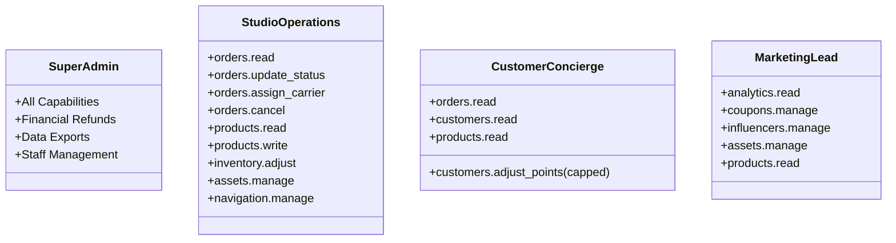

# ROLES & PERMISSIONS ARCHITECTURE: Granular RBAC
**The Petal & Bloom Commerce Operating System**
**Role:** Security Architect & Access Governance Specialist

---

## 1. Principles of Access Control

The Petal & Bloom platform implements **Capability-Based Role-Based Access Control (RBAC)**. 

Rather than checking role strings ad-hoc across UI components, the system defines granular, atomic capabilities. Roles are simply collections of capabilities assigned to users.

### Inviolable Security Tenets:
1. **Least Privilege:** Administrative users receive only the minimum permissions necessary to fulfill their daily duties.
2. **Dual-Layer Enforcement:** Permissions are enforced **first at the database layer** (via Supabase Row Level Security policies) and **second at the API / UI layer** (via route guards and serverless handler checks).
3. **Separation of Duties:** Financial mutations (refunds, loyalty point injections, data exports) are strictly gated from general operations staff.

---

## 2. Capability Catalog

| Capability Key | Description | Risk Level |
| :--- | :--- | :--- |
| `orders.read` | View orders, items, shipping details, and tracking timelines. | Low |
| `orders.update_status` | Advance fulfillment states (`PROCESSING`, `PACKED`, `SHIPPED`, `DELIVERED`). | Medium |
| `orders.assign_carrier` | Assign couriers and input AWB tracking numbers. | Medium |
| `orders.cancel` | Terminate an order and trigger automated stock restoration. | High |
| `orders.refund` | Execute a financial refund via Cashfree Payment Gateway. | **Critical** |
| `customers.read` | View patron directory, order histories, and saved addresses. | Low |
| `customers.export` | Download full customer PII database to CSV format. | **Critical** |
| `customers.adjust_points` | Manually credit or debit Petal Points to a loyalty account. | High |
| `products.read` | View catalog items, inventory counts, and configurations. | Low |
| `products.write` | Create, modify prices, edit descriptions, or publish pieces. | High |
| `products.delete` | Permanently remove a piece from the catalog. | High |
| `inventory.adjust` | Directly override physical stock numbers. | Medium |
| `coupons.manage` | Create, activate, deactivate, or delete promotional vouchers. | High |
| `influencers.manage` | Assign affiliate discount codes and review commission ledgers. | Medium |
| `analytics.read` | View aggregate revenue, GMV, AOV, and financial sales reports. | High |
| `assets.manage` | Upload and replace storefront editorial imagery and banners. | Medium |
| `navigation.manage` | Alter storefront navigation menus and links. | Medium |
| `settings.manage` | Change store policies, tax rules, or free shipping thresholds. | **Critical** |
| `audit.read` | Inspect system-wide administrative audit trails. | High |
| `staff.manage` | Invite, modify roles, or deactivate administrative user accounts. | **Critical** |

---

## 3. Standard Role Profiles



### 3.1 Super Admin / Founder
* **Description:** Complete, unrestricted operational and financial ownership.
* **Capabilities:** All 20 capabilities.
* **Unique Powers:** Processing refunds, exporting customer PII to CSV, managing staff roles, configuring tax and shipping fee thresholds.

### 3.2 Studio Operations & Logistics Lead
* **Description:** Manages the artisan crafting schedule, stem assembly, packaging inspection, and courier dispatch.
* **Capabilities:** `orders.read`, `orders.update_status`, `orders.assign_carrier`, `orders.cancel`, `products.read`, `products.write`, `inventory.adjust`, `assets.manage`, `navigation.manage`.
* **Prohibited From:** Issuing refunds, exporting customer databases, viewing gross bank settlement financials.

### 3.3 Customer Concierge Lead
* **Description:** Communicates with patrons via WhatsApp and email, answers order inquiries, updates delivery notes, and resolves minor gifting complaints.
* **Capabilities:** `orders.read`, `customers.read`, `customers.adjust_points` (capped to max 150 points without super admin approval), `products.read`.
* **Prohibited From:** Modifying catalog prices, canceling orders, issuing refunds, modifying navigation or site imagery.

### 3.4 Marketing & Brand Lead
* **Description:** Authors promotional campaigns, reviews sales velocity, manages influencer codes, and updates storefront visuals.
* **Capabilities:** `analytics.read`, `coupons.manage`, `influencers.manage`, `assets.manage`, `products.read`.
* **Prohibited From:** Accessing customer address books, modifying fulfillment states, issuing refunds.

---

## 4. Database Enforcement (RLS & Functions)

Administrative authorization is verified through PostgreSQL database functions:

```sql
-- Function to verify if user has admin privileges
CREATE OR REPLACE FUNCTION public.is_admin()
RETURNS boolean AS $$
BEGIN
  RETURN EXISTS (
    SELECT 1 FROM public.profiles
    WHERE id = auth.uid()
      AND role IN ('admin', 'super_admin')
  );
END;
$$ LANGUAGE plpgsql SECURITY DEFINER;

-- Function to verify super admin privileges
CREATE OR REPLACE FUNCTION public.is_super_admin()
RETURNS boolean AS $$
BEGIN
  RETURN EXISTS (
    SELECT 1 FROM public.profiles
    WHERE id = auth.uid()
      AND role = 'super_admin'
  );
END;
$$ LANGUAGE plpgsql SECURITY DEFINER;
```

---

## 5. Session Guarding & UI Visibility

* **Route Guard (`AdminRoute.tsx`):** Unauthenticated users or users with `role = 'customer'` attempting to navigate to `/admin/*` are immediately redirected to `/admin/login`.
* **Contextual UI Masking:** Sensitive action buttons (e.g. "Issue Refund" or "Export CSV") are conditionally rendered only when the current session's profile matches `super_admin`.
