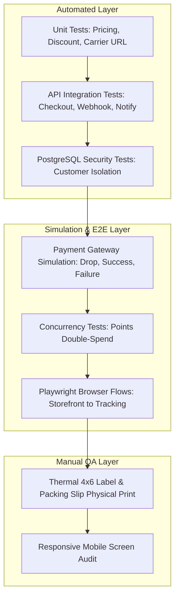

# TESTING & ACCEPTANCE PLAN: Quality Engineering Matrix
**The Petal & Bloom Commerce Operating System**
**Role:** Principal QA Engineer & Systems Verifier

---

## 1. Quality Standards: Objective Acceptance Criteria

Acceptance criteria in this platform are defined using strict, verifiable behaviors rather than subjective statements.

### Criterion Examples:
* ❌ *Vague:* "Admin can manage orders."
* ✅ *Objective:* "An authenticated user with role `admin` can navigate to `/admin/orders`, filter by status `PROCESSING`, select order `TPB-KT9X2-8921`, select carrier `DELHIVERY`, enter AWB `142385920194`, and click 'Save & Notify'. The database record updates with status `SHIPPED`, an immutable entry is added to `order_status_history`, a transactional dispatch email is delivered to the customer, and a pre-populated WhatsApp dispatch link is opened."

---

## 2. Comprehensive Test Matrix

---

## 3. Test Scenarios by Category

### 3.1 Category 1: Authoritative Checkout & Pricing Tests
* **TC-CHK-01 (Catalog Price Authority):** Submit a checkout payload with modified unit price `price: 1`.
  * *Expected Result:* Order record is created using the exact database price (`products.price_in_paise`). Tampered payload price is ignored.
* **TC-CHK-02 (Tiered Shipping Enforcement):**
  * Subtotal = ₹600 -> Shipping = ₹69.
  * Subtotal = ₹800 -> Shipping = ₹49.
  * Subtotal = ₹1,500 -> Shipping = ₹0 (Complimentary).
  * *Expected Result:* Shipping fees exactly match tiered INR business rules.
* **TC-CHK-03 (Coupon Max Cap):** Apply a 20% coupon with a max cap of ₹300 to a ₹2,000 cart.
  * *Expected Result:* Discount applied is capped at ₹300 (not ₹400).

---

### 3.2 Category 2: Payment Webhook & Idempotency Tests
* **TC-PAY-01 (Valid Signature Acceptance):** Send webhook with valid HMAC-SHA256 signature and `PAYMENT_SUCCESS_WEBHOOK`.
  * *Expected Result:* Returns `200 OK`; order updates to `PAYMENT_CONFIRMED`; stock decrements; confirmation email fires.
* **TC-PAY-02 (Invalid Signature Rejection):** Send webhook with altered body or invalid signature header.
  * *Expected Result:* Returns `400 Bad Request`; zero database mutations; alert logged.
* **TC-PAY-03 (Idempotency Duplicate Replay):** Re-send the exact payload from TC-PAY-01 with identical `event_id`.
  * *Expected Result:* Returns `200 OK` instantly; stock is **not** decremented a second time; loyalty points are **not** re-credited.

---

### 3.3 Category 3: Loyalty & Referral Invariant Tests
* **TC-LOY-01 (Immediate Balance Reservation):** Customer with 50 Petal Points initiates checkout redeeming 50 points.
  * *Expected Result:* `points_balance` in `loyalty_accounts` immediately drops to 0. A second checkout attempt in a parallel tab fails redemption.
* **TC-LOY-02 (Order Cancellation Point Restoration):** Admin cancels the order created in TC-LOY-01.
  * *Expected Result:* 50 points are credited back to customer's `loyalty_accounts`; `REFUND_RESTORE` entry written to ledger.
* **TC-REF-01 (Delayed Referral Reward):** Customer A refers Customer B. Customer B registers.
  * *Expected Result:* Customer B receives 50 welcome points. Customer A receives **0 points** (reward is pending).
* **TC-REF-02 (Referral Reward on First Order):** Customer B completes payment on their first bouquet.
  * *Expected Result:* Webhook automatically credits 100 Petal Points to Customer A's account with `REFERRAL_BONUS` description.

---

### 3.4 Category 4: PostgreSQL RLS Data Isolation Tests
* **TC-RLS-01 (Cross-Customer Order Isolation):** User A authenticated session queries `SELECT * FROM orders WHERE customer_id = 'USER_B_UUID'`.
  * *Expected Result:* Returns 0 rows.
* **TC-RLS-02 (Customer Cannot Modify Product Price):** User authenticated as `customer` executes `UPDATE products SET price_in_paise = 100`.
  * *Expected Result:* PostgreSQL throws permission denied error.
* **TC-RLS-03 (Admin Unrestricted Order Access):** User authenticated as `admin` executes query for all orders.
  * *Expected Result:* All rows returned successfully.

---

### 3.5 Category 5: Concurrency & Race Condition Tests
* **TC-CON-01 (Single Remaining Stock Race):** Product has `inventory_count = 1`. Two distinct users attempt checkout simultaneously.
  * *Expected Result:* User 1 completes checkout; inventory drops to 0. User 2's order is either blocked or cleanly handled via made-to-order fallback. Stock never drops to negative numbers.

---

## 4. Manual QA Verification Checklist for Operators

### Pre-Dispatch Packing Station Checklist:
1. [ ] Order status in workbench is verified as `PAYMENT_CONFIRMED`.
2. [ ] 4x6" Thermal Packing Slip generated and printed without overlapping text.
3. [ ] Stem count and yarn shade colors physically matched against work order.
4. [ ] Personalized gift card message transcribed verbatim onto floral card.
5. [ ] Courier partner selected (`SHIPROCKET`, `DELHIVERY`, or `INDIA_POST`).
6. [ ] AWB tracking number scanned from barcode into workbench.
7. [ ] "Save & Notify" clicked: Customer dispatch email verified in inbox.
8. [ ] WhatsApp Concierge dispatch link opened and confirmed.
